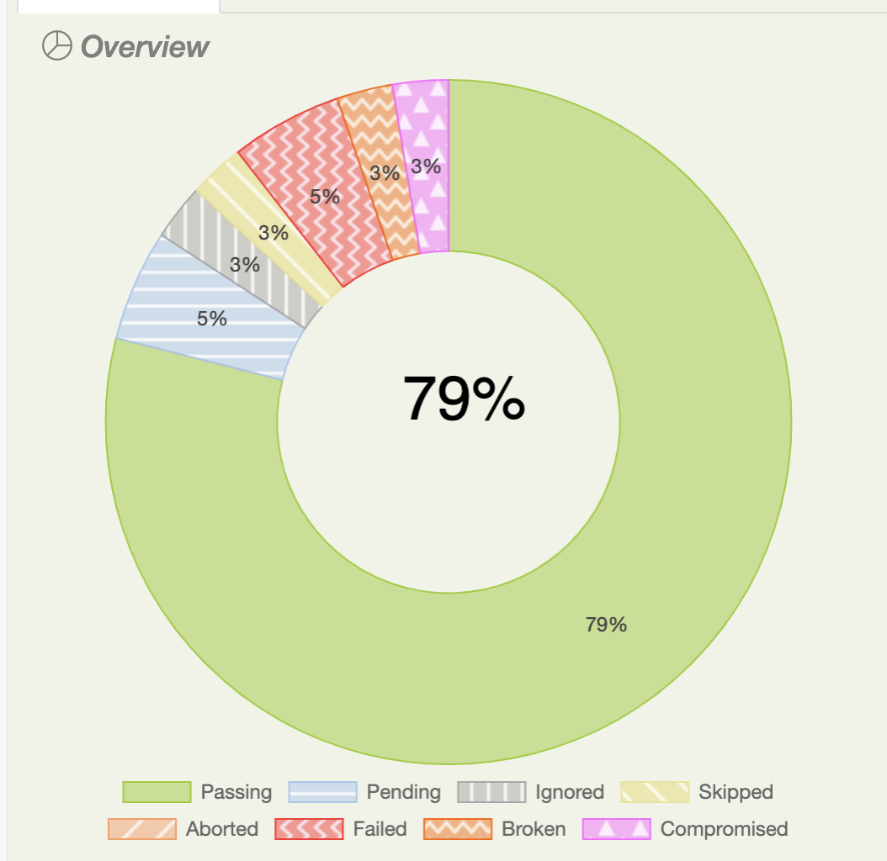

Serenity BDD is one of the most popular Java test automation libraries, and for good reason!

If you are writing automated web tests in Java, using Serenity BDD correctly can reduce the amount of code you need to write by well over 50%, slashing the amount of code you need to maintain yourself. Serenity BDD produces powerful test reports that you can use both as as evidence of your testing activities and documentation of your application. And with over a million downloads a month, regular releases and a vibrant open source community, it's a solid bet for your test automation framework!

In this article, we look at some of the new features in Serenity BDD version 3.1.0.

<!--truncate-->

## Selenium 4 Integration
Serenity 3.1.0 introduces support for Selenium 4.0.0 and Appium 8.0.0-BETA. Selenium 4 is the long-awaited update to Selenium, and includes many new features such as relative locators, better Docker integration with Selenium Grid.

## Improved Reporting
Serenity BDD is known for its powerful reporting and living documentation features, and in Serenity 3.1.0 the reports have been updated and improved, with many new features and an updated look and feel.


### Test Duration Reports
A new chart has been added to show test duration more clearly. You can also drill down into any of the duration buckets to see which tests are slow.


### Accessibility Mode
Serenity BDD 3.1.0 introduces the option to use patterns as well as colours in the charts to make them easier to read for colour vision deficient viewers. You can activate this mode by setting the setting the `serenity.report.accessibility` property to true.



### Better Test Result Reporting
The test results for individual features has also been improved to include the additional reporting elements:


Scenario and example outcomes are also colour-coded to make it easier to see the results at a glance:


## Improved WebDriverManager integration

[WebDriverManager](https://github.com/bonigarcia/webdrivermanager) has a lot of new Selenium 4 features, including the ability to setup a docker instance on the fly. Serenity 3.1.0 provides smooth integration with WebDriverManager with the `WebDriverManagerEnhancer` interface. Just create your own implementation of this interface, and place the implementation in a package that you specify in the `serenity.extension.packages` property. Here's an example:

```
public class SampleWebDriverManagerEnhancer implements WebDriverManagerEnhancer {
    @Override
    public WebDriverManager apply(WebDriverManager webDriverManager) {
        return webDriverManager.browserInDocker().enableVnc().enableRecording();
    }
}
```

## Locatorless Web Elements
Locatorless web elements are a convenient way Serenity Screenplay lets us locate commonly used elements on a page without needing to write complicated CSS or XPath selectors.

For example, consider the following page:


We could locate and click on the Checkout button with the following code:
```
actor.attemptsTo(
    Click.on(Button.called("Checkout"))
);
```
Elements are located by human-readable names, which can correspond to the visible text in the element, or an attribute such as id, value or data-test. Heuristic rules are used to determine appropriate locator strategies for different elements.

In other cases, we may want to be more precise. For example, we can also identify form elements by their value or their label:
```
actor.attemptsTo(
    Click.on(Checkbox.withLabel("Terms and conditions"))
);
```

We can also locate elements that are nested inside other elements. For example, the following page contains several "Add to cart" buttons:


However, using locatorless elements, we could click on a specific "Add to cart" button like this:

```
actor.attemptsTo(
    Click.on(Button.called("Add to cart")
           .inside(PageElement.called("inventory_item")
		                                 .containingText("Sauce Labs Backpack"))
    )
);
```
Locatorless elements can help make your code both easier to read and quicker to write, and also more robust, since they may try more than one locator strategy to locate the element you are looking for.

Supported elements include:
  * Button
  * Checkbox
  * Dropdown
  * Image
  * InputField
  * Link
  * RadioButton
  * PageElement

## Single Browser Mode
Sometimes it is useful to be able to run a series of tests in the same browser. This can speed up the tests, though it is important not to allow dependencies to occur between the tests.

To maintain a test open for the duration of a feature or scenario outline, just add the `@singlebrowser` tag, as in the following example:

```
Feature: Login

  Rule: Customers needs to provide valid credentials to access the site

    Example: Colin logs in with valid credentials
      Given Colin is on the login page
      When Colin logs in with valid credentials
      Then he should be presented the product catalog

    @singlebrowser
    Scenario Outline: Login on with invalid credentials
      Given Colin is on the login page
      When Colin attempts to login with the following credentials:
        | username   | password   |
        | <username> | <password> |
      Then he should be presented with the error message <message>
      Examples:
        | username        | password       | message                                                     |
        | standard_user   | wrong_password | Username and password do not match any user in this service |
        | unknown_user    | secret_sauce   | Username and password do not match any user in this service |
        | unknown_user    | wrong_password | Username and password do not match any user in this service |
        | locked_out_user | secret_sauce   | Sorry, this user has been locked out.                       |
```

In JUnit you can use the `@SingleBrowser` annotation for the same result, as shown in this JUnit 5 test:
```
@ExtendWith(SerenityJUnit5Extension.class)
@SingleBrowser
public class WhenLoggingOn {

    @Managed(options = "headless")
    WebDriver driver;

    @CastMember
    Actor charles;

    @ParameterizedTest(name = "{index}: {2}")
    @CsvSource(value = {
            "                       ,secret_sauce       , Username is required",
            "standard_user  ,                          , Password is required",
            "                       ,                          , Username is required",
            "standard_user  , wrong_password , Username and password do not match any user in this service",
            "wrong_user     , secret_sauce       , Username and password do not match any user in this service",
    })
    public void withInvalidCredentials(String username, String password, String errorMessage) {
        charles.attemptsTo(
                Login.withCredentials(username, password),
                Ensure.that(LoginForm.ERROR_MESSAGE).text().contains(errorMessage)
        );
    }
}
```

## Want to learn more?
There are several courses on Serenity BDD in the **[Serenity Dojo Training Library](https://expansion.serenity-dojo.com)**, including
* **[Write Better Automated Tests Faster With Serenity BDD, Cucumber and The Screenplay Pattern](https://expansion.serenity-dojo.com/courses/serenity-and-the-screenplay-pattern)** - a free deep-dive course into writing scalable, maintainable tests with Serenity BDD and the Screenplay pattern
* **[Effective UI Test Automation With Serenity BDD and Selenium](https://expansion.serenity-dojo.com/courses/testing-web-applications-with-serenity-bdd)** - learn the fundamentals of web testing with Serenity BDD in this very detailed course.
* **[Next-generation Automated Acceptance Tests With Serenity Screenplay](https://expansion.serenity-dojo.com/courses/writing-more-sustainable-tests-with-the-screenplay-pattern)** - Learn everything you need to know to master scalable test automation with the powerful Screenplay pattern.
* **[Testing REST APIs with Serenity BDD and RestAssured](https://expansion.serenity-dojo.com/courses/testing-rest-apis-with-serenity-bdd)** - Learn how to test REST web services in Serenity BDD.
