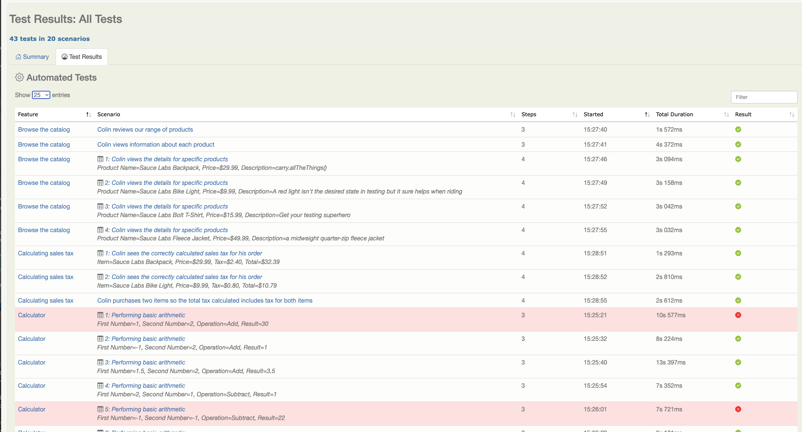

Serenity BDD is one of the most popular Java test automation libraries, and for good reason!

If you are writing automated web tests in Java, using Serenity BDD correctly can reduce the amount of code you need to write by well over 50%, slashing the amount of code you need to maintain yourself. Serenity BDD produces powerful test reports that you can use both as as evidence of your testing activities and documentation of your application. And with over a million downloads a month, regular releases and a vibrant open source community, it's a solid bet for your test automation framework!

In this article, we look at some of the new features in Serenity BDD version 3.4.2.

<!--truncate-->
## Selenium 4.6.0 Integration
Serenity 3.4.2 integrates with [Selenium 4.6.0](https://www.selenium.dev/blog/2022/selenium-4-6-0-released/), which includes a number of new features. One of the more interesting is it's ability to automatically download the correct driver binaries for whatever browser you are using. Serenity currently does this using WebDriverManager, but as this feature is now build into Selenium, the Serenity WebDriverManager integration is now disabled by default and will be removed in a future version.

## Improved Reporting For Data-Driven Tests

Test results for data-driven tests (parameterized tests in JUnit and Scenario Outlines in Cucumber) are now reported individually, giving a more precise view of the test status:

## Standardised naming

To avoid confusion in the summary views, the reports now adopt a more conventional definition of scenarios and test cases for data-driven tests. _Scenario_ refers to the scenario outline or overall test, whereas _Test Case_ refers to a specific execution of a scenario with a specific set of test data.

## Want to learn more?
There are several courses on Serenity BDD in the **[Serenity Dojo Training Library](https://expansion.serenity-dojo.com)**, including
* **[Write Better Automated Tests Faster With Serenity BDD, Cucumber and The Screenplay Pattern](https://expansion.serenity-dojo.com/courses/serenity-and-the-screenplay-pattern)** - a free deep-dive course into writing scalable, maintainable tests with Serenity BDD and the Screenplay pattern
* **[Effective UI Test Automation With Serenity BDD and Selenium](https://expansion.serenity-dojo.com/courses/testing-web-applications-with-serenity-bdd)** - learn the fundamentals of web testing with Serenity BDD in this very detailed course.
* **[Next-generation Automated Acceptance Tests With Serenity Screenplay](https://expansion.serenity-dojo.com/courses/writing-more-sustainable-tests-with-the-screenplay-pattern)** - Learn everything you need to know to master scalable test automation with the powerful Screenplay pattern.
* **[Testing REST APIs with Serenity BDD and RestAssured](https://expansion.serenity-dojo.com/courses/testing-rest-apis-with-serenity-bdd)** - Learn how to test REST web services in Serenity BDD.
