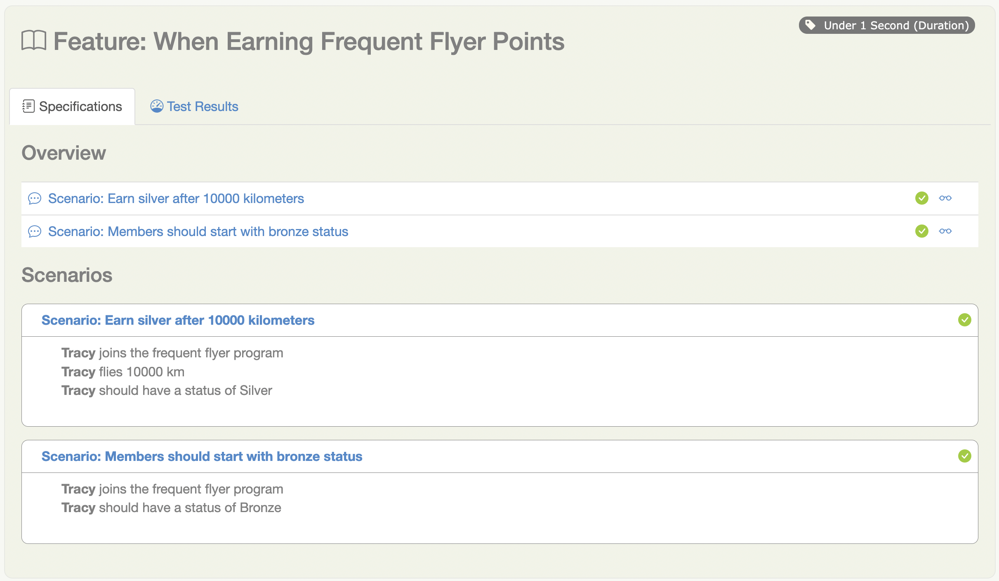

# Serenity Step Libraries
In Serenity, tests are broken down into reusable steps. An important principle behind Serenity is the idea that it is easier to maintain a test that uses several layers of abstraction to hide the complexity behind different parts of a test.

In an automated acceptance test, test steps represent the level of abstraction between the code that interacts with your application (for example, Page Component Objects in an automated web test, which model parts of the user interface, or API endpoints for web services you need to interact with) and higher-level stories (sequences of more business-focused actions that illustrate how a given user story has been implemented). If your automated test is not UI-oriented (for example, if it calls a web service), steps orchestrate other more technical components such as REST clients. Steps can contain other steps, and are included in the Serenity reports. Whenever a UI step is executed, a screenshot is stored and displayed in the report.

## Breaking down tests into steps
Suppose we are testing a Frequent Flyer programme, and need to illustrate the following business rules:

- Members should start with Bronze status
- Members should earn Silver status after flying 10,000 km.

Each of these can be broken down further into business tasks and verifications. For example, the first rule could be broken into two steps:
- Create a new Frequent Flyer member
- Check that the member has a status of Bronze

And the second can be broken into three steps:
- Create a new Frequent Flyer member
- Make the member fly 10000 km
- Check that the member has a status of Silver

We could express these tests using Serenity in JUnit as follows:

```java
package flyer;

import net.serenitybdd.junit.runners.SerenityRunner;
import net.thucydides.core.annotations.Steps;
import org.junit.Test;
import org.junit.runner.RunWith;
import flyer.steps.TravellerEarningStatusPoints;

import static flyer.Status.Bronze;
import static flyer.Status.Silver;

@ExtendWith(SerenityJUnit5Extension.class)
public class WhenEarningFrequentFlyerPoints {

    @Steps
    TravellerEarningStatusPoints tracy;

    @Test
    public void members_should_start_with_Bronze_status() {
        // GIVEN
        tracy.joins_the_frequent_flyer_program();

        // THEN
        tracy.should_have_a_status_of(Bronze);
    }

    @Test
    public void earn_silver_after_10000_kilometers() {
        // GIVEN
        tracy.joins_the_frequent_flyer_program();

        // WHEN
        tracy.flies(10000);

        // THEN
        tracy.should_have_a_status_of(Silver);
    }
}
```

Notice how the second test reuses step methods used in the first to perform a slightly different test. This is a typical example of the way we reuse steps in similar tests, in order to avoid duplicated code and make the code easier to maintain.

## Implementing Simple Step Libraries
The `TravellerEarningStatusPoints` class is what we call a step library. We use the `@Steps` class as shown above to indicate a step library in our test code: this annotation tells Serenity to instantiate and instrument this field, so that methods you call in this library also appear in the test reports.

Step libraries contain the business tasks or actions that a user performs during a test. There are many ways to organise your step libraries, but a convenient way is to group methods in slices of business behaviour for a given type of user. In this case a traveller who is earning status points.

Notice that it was not necessary to explicitly instantiate the Steps class `TravellerEarningStatusPoints`. When you annotated a member variable of this class with the `@Steps` annotation, Serenity BDD will automatically instantiate it for you.

You should never create instances of step libraries using the `new` keyword, as Serenity will not be able to instrument the step library correctly, and the methods called will not appear in the reports.

For example, suppose we want to test a simple calculator UI. In this class, we use the `CalculatorSteps` step library, which we annotate with the `@Steps` annotation:

```java
@ExtendWith(SerenityJUnit5Extension.class)
class WhenDoingSums {

    @Steps
    CalculatorSteps calulate;

    @Nested
    class ABasicCalculator {

        @BeforeEach
        void openTheCalculator() {
            calulate.openTheCalculatorApp();
        }

        @Test
        void shouldCalculateAdditions() {
            int result = calulate.theAnswerTo("1","+","2");
            assertThat(result).isEqualTo(3);
        }

        @Test
        void shouldCalculateSubtractions() {
            int result = calulate.theAnswerTo("7","-","3");
            assertThat(result).isEqualTo(4);
        }

        @Test
        void shouldCalculateMultiplications() {
            int result = calulate.theAnswerTo("3","*","2");
            assertThat(result).isEqualTo(6);
        }

        @Test
        void shouldCalculateDivisions() {
            int result = calulate.theAnswerTo("10","/","2");
            assertThat(result).isEqualTo(5);
        }
    }
}
```

The `CalculatorSteps` class defines the steps a user needs to perform - in this case, perform a calculation on the calculator app:

```java
public class CalculatorSteps {

    @Step("Calculate the answer to {0} {1} {2}")
    public int theAnswerTo(String a, String operator, String b) {
        // Interact with the the calculator to perform the calculation
    }
}
```

Step methods are annotated with the `@Step` annotation, which tells Serenity to include this method in the Serenity test reports. The value we include in the `@Step` annotation is the text that will appear in the Serenity reports when this step is executed. The numbers in curly brackets (`{0}`,`{1}` and `{2}`) represent placeholders the method parameters, if we want them to appear in the reports.

When we run this test case, Serenity will document the steps that get executed during each test, producing a living documentation of the test execution:


### UI Interaction Classes

Suppose our calculator test needs to interact with a web UI, such as the one on https://juliemr.github.io/protractor-demo/ shown here:


We can access the powerful Serenity BDD Selenium integration in our step libraries by extending the `net.serenitybdd.core.steps.UIInteractions` class. A very simple implementation might look like this:

```java
public class CalculatorSteps extends UIInteractions {

     @Step
    public void openTheCalculatorApp() {
        openUrl("https://juliemr.github.io/protractor-demo/");
    }

   @Step("Calculate the answer to {0} {1} {2}")
    public int theAnswerTo(String firstValue, String operator, String secondValue) {

        $("[ng-model=first]").sendKeys(firstValue);
        $("[ng-model=operator]").selectByVisibleText(operator);
        $("[ng-model=second]").sendKeys(secondValue);
        $("#gobutton").click();
        waitForAngularRequestsToFinish();

        return Integer.parseInt($("css:h2").getText());
    }
}
```

A more readable, refactored implementation might look like this:

```java
public class CalculatorSteps extends UIInteractions {

    private static final By FIRST_VALUE_FIELD = By.cssSelector("[ng-model=first]");
    private static final By SECOND_VALUE_FIELD = By.cssSelector("[ng-model=second]");
    private static final By OPERATOR_DROPDOWN = By.cssSelector("[ng-model=operator]");
    private static final By GO_BUTTON = By.id("gobutton");
    private static final By RESULT_FIELD = By.tagName("h2");
    private static final Pattern A_VALID_NUMBER = Pattern.compile("-?\\d\\.?d*");

    @Step
    public void openTheCalculatorApp() {
        openUrl("https://juliemr.github.io/protractor-demo/");
    }

    @Step("Calculate the answer to {0} {1} {2}")
    public int theAnswerTo(String firstValue, String operator, String secondValue) {

        $(FIRST_VALUE_FIELD).sendKeys(firstValue);
        $(OPERATOR_DROPDOWN).selectByVisibleText(operator);
        $(SECOND_VALUE_FIELD).sendKeys(secondValue);
        $(GO_BUTTON).click();
        waitFor(ExpectedConditions.textMatches(RESULT_FIELD,A_VALID_NUMBER));

        return Integer.parseInt($(RESULT_FIELD).getText());
    }
}
```

The tests will now interact with the user interface, report on both the steps executed, and (if configured to do so) record screenshots for each step:


### Persona Step Libraries

Another approach to modeling step libraries revolves around actors and roles. Let's return to our original example: Tracy, the traveller, who earns points when she travels.

```java
public class TravellerEarningStatusPoints {

    private String actor;

    private FrequentFlyer frequentFlyer;

    @Step("#actor joins the frequent flyer program")   
    public void joins_the_frequent_flyer_program() {
        frequentFlyer = FrequentFlyer.withInitialBalanceOf(0);
    }

    @Step("#actor flies {0} km")
    public void flies(int distance) {
        frequentFlyer.recordFlightDistanceInKilometers(distance);
    }

    @Step("#actor should have a status of {0}")
    public void should_have_a_status_of(Status expectedStatus) {
        assertThat(frequentFlyer.getStatus()).isEqualTo(expectedStatus);
    }

    @Step("#actor transfers {0} points to {1}")
    public void transfers_points(int points, TravellerEarningStatusPoints otherFrequentFlier) {
        // Left as an exercise
    }

    @Override
    public String toString() {
        return actor;
    }

    @Step("#actor should have {0} points")
    public void should_have_points(int expectedPoints) {
        // Left as an exercise
    }
}
```

This approach uses the concept of _persona_ step libraries, where a step library represents the actions of a specific user performing a specific task (Tracy the traveller who is earning points.) In this case, Serenity will automatically instantiate the _actor_ field with the name of the step library variable (`tracy`), allowing it to appear in the test reports to make them more readable:




## Shared Instances of Step Libraries
There are some cases where we want to reuse the same step library instance in different places across a test. For example, suppose we have a step library that interacts with a backend API, and that maintains some internal state and caching to improve performance. We might want to reuse a single instance of this step library, rather than having a separate instance for each variable.

We can do this by declaring the step library to be shared, like this:

```java
@Steps(shared = true)
CustomerAPIStepLibrary customerAPI;
```

Now, any other step libraries of type `CustomerAPIStepLibrary`, that have the shared attribute set to true will refer to the same instance.

In older versions of Serenity, sharing instances was the default behaviour, and you used the uniqueInstance attribute to indicate that a step library should not be shared. If you need to force this behaviour for legacy test suites, set the step.creation.strategy property to legacy in your serenity.properties file:

```javascript
step.creation.strategy = legacy
```
