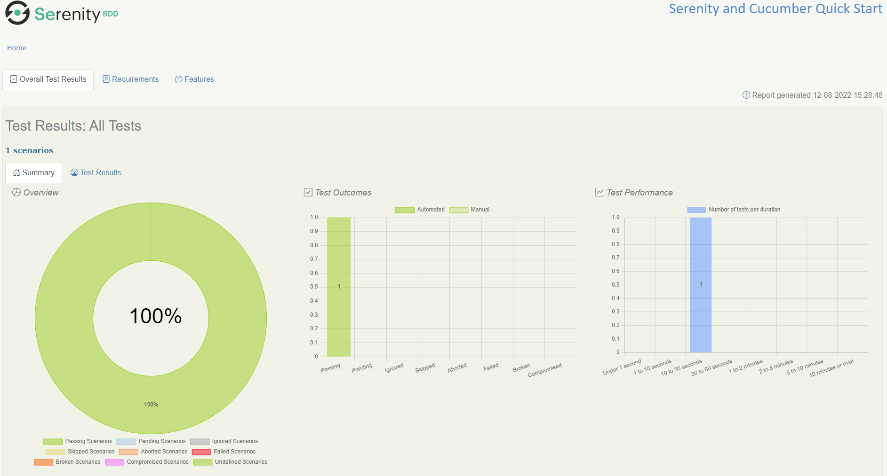
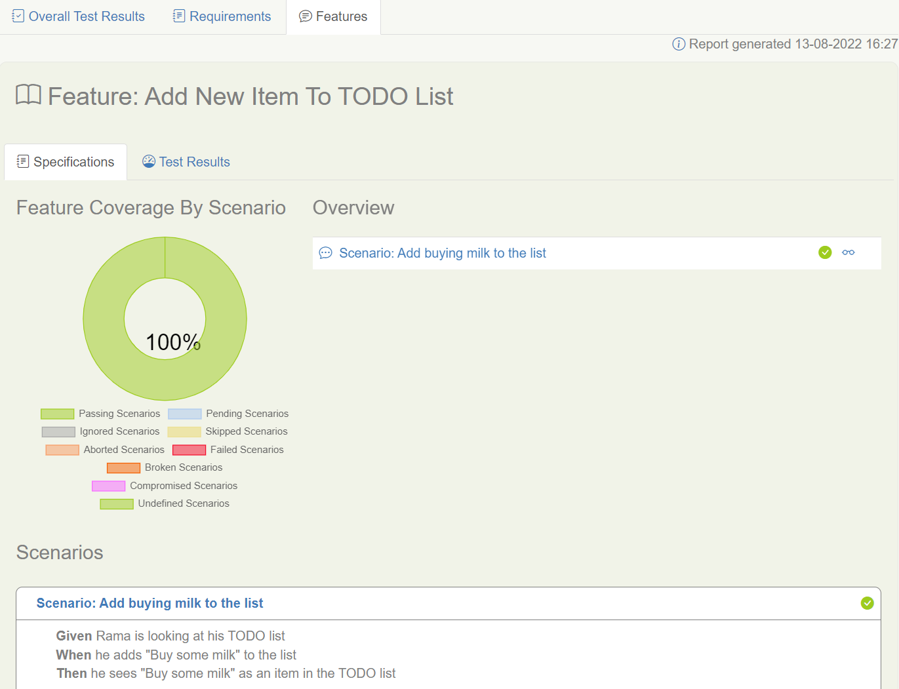

# Getting Started With Cucumber using Serenity BDD and Screenplay

:::tip Comprehensive Cucumber Guide Available
This tutorial focuses on getting started with Cucumber and Screenplay. For comprehensive coverage of Cucumber configuration, JUnit 5 integration, parallel execution, and advanced topics, see the [Cucumber with JUnit 5](/docs/cucumber/cucumber-junit5) section.
:::

## Objectives
At the end of this tutorial, you would have completed the following activities.
1. Write your first **specification by example** using [Gherkin](https://cucumber.io/docs/gherkin/reference/) language in a `.feature` file for the well-known [TodoMVC](http://todomvc.com) project
2. Make the specification (the `.feature` file from Step 1 above) executable using Serenity BDD and Cucumber with Screenplay pattern
3. Create a **living documentation** that also serves as a test report and a progress report

## Pre-requisites
To run this tutorial, you will need a few things installed on your machine:
* **Java**: Serenity BDD is a Java library, so you'll need a recent JDK installed. JDK 17 or higher should be fine.
* **Maven**: You will need Maven 3 or higher installed in your computer.  This acts as a build tool that also downloads the dependencies while building.
* **A Java IDE**: You'll also need a Java Development Environment such as IntelliJ or Eclipse (and a working knowledge of Java).
* **Git**: We'll be using a starter project on Github, and the sample code for this project lives on Github too, so I'll be assuming you have a basic understanding of Git.

## Creating your project

The quickest way to start a new Serenity BDD with [Cucumber](https://cucumber.io/) project is to clone the starter project. For this tutorial, We will be using the **[Serenity BDD with Cucumber and Screenplay](https://github.com/serenity-bdd/serenity-cucumber-starter)** template project, which uses Serenity BDD and Cucumber 6.x.

This project comes with a sample feature file already implemented for our reference.  For now, we are going to ignore that and start writing a new feature file from scratch.

:::info

Just to make sure that the starter template's sample files do not interfere with our experience in this tutorial, **delete** the following files/directories.

1. Directory - `src/test/resources/features/search`
2. Directory -  `src/test/java/starter/navigation`
3. Directory -  `src/test/java/starter/search`
4. File - `src/test/java/starter/stepdefinitions/SearchStepDefinitions.java`

:::

## The project directory structure
We will use some simple conventions to organise our feature files and the supporting Java classes, based on the standard Maven project structure outlined below:

```
src
├───main
│   └───java
│       └───starter
└───test
    ├───java
    │   └───starter
    │       └───helpers
    │       └───stepdefinitions
    └───resources
        └───features
```

Here are some points to note about the directory structure.
1. Since we will test the publicly available [TodoMVC](http://todomvc.com) web application, we will not have any code in the `src/main` directory.
2. We will use the `src/test/resources/features` directory to store our `.feature` files, which are specifications that define the requirements.
3. We will use the `src/test/java/starter/stepdefinitions` directory to store the code implementing the steps mentioned in our `.feature` files.  This code is called Glue code or the Step definitions.
4. We will use the `src/test/java/starter/helpers` directory to store the code for any helper classes that are needed by our step definitions.

## Writing the first feature file
Now, let us start with writing a feature file to describe adding a new item to the to-do list.

Create a new file with name `add_new_todo.feature` in the `src/test/resources/features` directory with the following content.

```gherkin
Feature: Add new item to TODO list

Scenario: Add buying milk to the list
Given Rama is looking at his TODO list
When he adds "Buy some milk" to the list
Then he sees "Buy some milk" as an item in the TODO list
```

## Writing the step definitions skeleton
In order to translate the steps in the `add_new_todo.feature` into executable actions, we write Java classes called **Step Definitions**.

Let us create a new file named `AddItemStepDefinitions.java` in the directory `src/test/java/starter/stepdefinitions` with the following skeleton content.  Note that this is only a skeleton content. We will add flesh to this class later.

```java
package starter.stepdefinitions;

import io.cucumber.java.PendingException;
import io.cucumber.java.en.Given;
import io.cucumber.java.en.Then;
import io.cucumber.java.en.When;
import net.serenitybdd.screenplay.Actor;

public class AddItemStepDefinitions {

    @Given("{actor} is looking at his TODO list")
    public void actor_is_looking_at_his_todo_list(Actor actor) {
        // Write code here that turns the phrase above into concrete actions
        throw new PendingException("Implement me");
    }
    @When("{actor} adds {string} to the list")
    public void he_adds_to_the_list(Actor actor, String itemName) {
        // Write code here that turns the phrase above into concrete actions
        throw new PendingException("Implement me");
    }
    @Then("{actor} sees {string} as an item in the TODO list")
    public void he_sees_as_an_item_in_the_todo_list(Actor actor, String expectedItemName) {
        // Write code here that turns the phrase above into concrete actions
        throw new PendingException("Implement me");
    }

}
```

The above file just throws exceptions whenever Cucumber tries to execute the steps and mark them as Pending.

Let us try running the Maven build to see the result at this stage.  We expect the build to fail stating that scenarios are pending to be implemented.

Run the following command in a terminal or command prompt.

```bash
mvn clean verify
```

Once the command completes, you can see output similar to the following.

```
[ERROR] Tests run: 1, Failures: 0, Errors: 1, Skipped: 0, Time elapsed: 7.255 s <<< FAILURE! - in starter.CucumberTestSuite
[ERROR] Add new item to TODO list.Add buying milk to the list  Time elapsed: 0.713 s  <<< ERROR!
io.cucumber.java.PendingException: TODO: implement me

[INFO] 
[INFO] Results:
[INFO]
[ERROR] Errors: 
[ERROR]   TODO: implement me
[INFO]
[ERROR] Tests run: 1, Failures: 0, Errors: 1, Skipped: 0

...
...
...

[INFO] -----------------------------------------
[INFO]  SERENITY TESTS: PENDING
[INFO] -----------------------------------------
[INFO] | Test cases executed    | 1
[INFO] | Tests executed         | 1
[INFO] | Tests passed           | 0
[INFO] | Tests failed           | 0
[INFO] | Tests with errors      | 0
[INFO] | Tests compromised      | 0
[INFO] | Tests aborted          | 0
[INFO] | Tests pending          | 1
[INFO] | Tests ignored/skipped  | 0
[INFO] ------------------------ | --------------
[INFO] | Total Duration         | 365ms
[INFO] | Fastest test took      | 365ms
[INFO] | Slowest test took      | 365ms
[INFO] -----------------------------------------

...
...
...

[INFO]
[INFO] --- maven-failsafe-plugin:3.0.0-M5:verify (default) @ cucumber-starter ---
[INFO] ------------------------------------------------------------------------
[INFO] BUILD FAILURE
[INFO] ------------------------------------------------------------------------
[INFO] Total time:  30.465 s
[INFO] Finished at: 2022-08-12T14:52:57+05:30
[INFO] ------------------------------------------------------------------------

```

The above output is as we expected.  The build is failing with a `PendingException` and the tests are marked as pending.

## Creating Helper Classes for Step Definitions
So far, we have only dummy step definitions.  Let us implement real tests now.  In order to implement the real tests, let us create a few helper classes.

#### Page Object
Let us first create a file `TodoListPage.java` in the directory `src/test/java/starter/helpers` with the following content.

```java
package starter.helpers;

import net.serenitybdd.core.pages.PageObject;
import net.serenitybdd.screenplay.targets.Target;
import net.serenitybdd.annotations.DefaultUrl;


@DefaultUrl("https://todomvc.com/examples/angular/dist/browser/#/all")
public class TodoListPage extends PageObject {
    public static Target ITEM_NAME_FIELD = Target.the("item name field").locatedBy(".new-todo");

    public static Target ITEMS_LIST = Target.the(" item list").locatedBy(".todo-list li");
}
```

This class is what we call as a `PageObject`.  This contains all the information we will need to use a particular web page, the TODO app, in this case.

The `@DefaultUrl` annotation specifies the URL that needs to be typed in the browser's address bar to access this page.

There are two static fields `ITEM_NAME_FIELD` and `ITEMS_LIST` that help identify specific HTML elements on the page, which we will use later in our step definition files.

#### Navigation Helper 

Let us create a file `NavigateTo.java` in the directory `src/test/java/starter/helpers` with the following content.

```java
package starter.helpers;

import net.serenitybdd.screenplay.Performable;
import net.serenitybdd.screenplay.Task;
import net.serenitybdd.screenplay.actions.Open;

public class NavigateTo {
     public static Performable theTodoListPage() {
        return Task.where("{0} opens the Todo list page",
                Open.browserOn().the(TodoListPage.class));
    }
}
```
The above class uses Serenity BDD's [Screenplay pattern](/docs/screenplay/screenplay_fundamentals) to describe the behavior in a lucid manner.  This class helps us to open the browser with the proper URL.

#### Action Definition

Next, let us create a file `AddAnItem.java` in the directory `src/test/java/starter/helpers` with the following content.

```java
package starter.helpers;

import net.serenitybdd.screenplay.Performable;
import net.serenitybdd.screenplay.Task;
import net.serenitybdd.screenplay.actions.Enter;
import org.openqa.selenium.Keys;

public class AddAnItem {

    public static Performable withName(String itemName){
        return Task.where("{0} adds an item with name "+itemName,
                Enter.theValue(itemName)
                        .into(TodoListPage.ITEM_NAME_FIELD)
                        .thenHit(Keys.ENTER)
        );
    }
}
```

The above code explains the steps needed to add an item to the list, i.e., typing the item name in the text box and pressing the ENTER key.

## Adding Details to Step Definitions

Now that our helper classes are ready, we can add real details to the step definitions present in `AddItemStepDefinitions.java`

Open the `AddItemStepDefinitions.java` file (we already created this file) and edit it to have the following content.

```java
package starter.stepdefinitions;

import io.cucumber.java.en.Given;
import io.cucumber.java.en.Then;
import io.cucumber.java.en.When;
import net.serenitybdd.screenplay.Actor;
import net.serenitybdd.screenplay.ensure.Ensure;
import starter.helpers.AddAnItem;
import starter.helpers.NavigateTo;
import starter.helpers.TodoListPage;

public class AddItemStepDefinitions {
    @Given("{actor} is looking at his TODO list")
    public void actor_is_looking_at_his_todo_list(Actor actor) {
        actor.wasAbleTo(NavigateTo.theTodoListPage());
    }
    @When("{actor} adds {string} to the list")
    public void he_adds_to_the_list(Actor actor, String itemName) {
       actor.attemptsTo(AddAnItem.withName(itemName));
    }
    @Then("{actor} sees {string} as an item in the TODO list")
    public void he_sees_as_an_item_in_the_todo_list(Actor actor, String expectedItemName) {
        actor.attemptsTo(Ensure.that(TodoListPage.ITEMS_LIST).hasText(expectedItemName));
    }

}
```

Notice how the code reads like the spoken English.  This is one of the pleasant side-effects of using Screenplay pattern in your Cucumber step definitions.

## Running the build again

Now, let us run the build again by issuing the following command from the terminal or command line.

```bash
mvn clean verify
```

Now, you will see the following output.

```
[INFO] Tests run: 1, Failures: 0, Errors: 0, Skipped: 0, Time elapsed: 28.42 s - in starter.CucumberTestSuite
[INFO] 
[INFO] Results:
[INFO]
[INFO] Tests run: 1, Failures: 0, Errors: 0, Skipped: 0

...
...
...

[INFO] -----------------------------------------
[INFO]  SERENITY TESTS: SUCCESS
[INFO] -----------------------------------------
[INFO] | Test cases executed    | 1
[INFO] | Tests executed         | 1
[INFO] | Tests passed           | 1
[INFO] | Tests failed           | 0
[INFO] | Tests with errors      | 0
[INFO] | Tests compromised      | 0
[INFO] | Tests aborted          | 0
[INFO] | Tests pending          | 0
[INFO] | Tests ignored/skipped  | 0
[INFO] ------------------------ | --------------
[INFO] | Total Duration         | 20s 001ms
[INFO] | Fastest test took      | 20s 001ms
[INFO] | Slowest test took      | 20s 001ms
[INFO] -----------------------------------------
[INFO]
[INFO] SERENITY REPORTS
[INFO]   - Full Report: file:///C:/Users/calib/source-codes/temp/serenity-cucumber-starter/target/site/serenity/index.html
[INFO]
[INFO] --- maven-failsafe-plugin:3.0.0-M5:verify (default) @ cucumber-starter ---
[INFO] ------------------------------------------------------------------------
[INFO] BUILD SUCCESS
[INFO] ------------------------------------------------------------------------
[INFO] Total time:  49.894 s
[INFO] Finished at: 2022-08-12T15:28:52+05:30
[INFO] ------------------------------------------------------------------------

```

Yes, the tests passed and the build is successful now.  We have managed to test our feature successfully 🎉

## Reporting and Living Documentation

If you notice carefully, the output of the `mvn clean verify` command informed us that a report is created in `target/site/serenity/index.html`

When you open this file in a web browser, you see a beautiful report like this.



You can also find the feature-wise results detailing the scenarios in the `Features` tab.



Feel free to navigate the links in this report and look around.

This is also called a **Living Documentation** of the product because, this is generated by actually executing the specifications, rather than just writing it as a wiki or a document stored in cloud.  As the product evolves, the scenarios will get added and this report is the single source of truth about what works and what is pending to be implemented in the product.

In some cases, teams use this document to onboard new joiners to the team.  If you are feeling adventurous, this document can also be used as a user guide.

## Next Steps
In this tutorial, we just touched the surface of using Serenity BDD with Cucumber.  There are multiple ways to customize the report, organize the feature files, implement the step definitions and so on.  Refer to the links in the user manual to know more about further possibilities.

