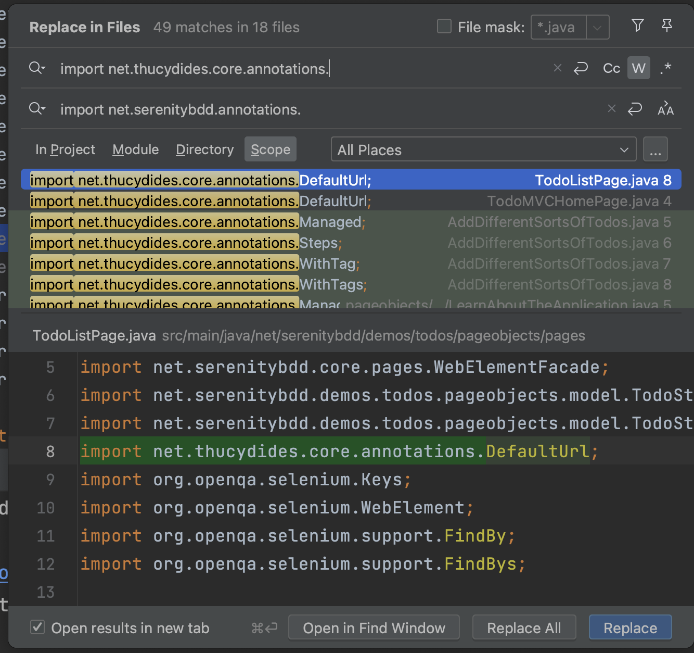

# Migrating From Serenity BDD 3.x to Serenity BDD 4.x

## Introduction
Serenity BDD 4.0.0 is a significant update that aligns with modern testing libraries by supporting Java 11. This major release includes changes to package structures, reflecting adjustments in the module structure for Java 11. If you are migrating from Serenity 3.x to Serenity 4.x, this tutorial will guide you through the necessary steps to make your project compatible with the latest version.

## Step 1: Ensure Java 11 Compatibility
Make sure your project is compatible with Java 11, as Serenity BDD 4.x requires it as a minimum version. If you are using Maven, update your project's `pom.xml` file to include the `maven-compiler-plugin` configured for Java 11. Here's an example:

```xml
<plugin>
  <groupId>org.apache.maven.plugins</groupId>
  <artifactId>maven-compiler-plugin</artifactId>
  <version>3.8.1</version>
  <configuration>
    <source>11</source>
    <target>11</target>
  </configuration>
</plugin>
```

If your project uses Gradle, you'll need to specify the Java version in your `build.gradle` file to ensure compatibility with Java 11. Here's an example:

```groovy
plugins {
  id 'java'
}

sourceCompatibility = '11'
targetCompatibility = '11'
```

## Step 2: Update Serenity Dependencies
Update the Serenity BDD dependencies in your project's build file to the latest 4.x version, e.g.

```xml
    <properties>
        <serenity.version>4.0.0</serenity.version>
    </properties>
    <dependencies>
        <dependency>
            <groupId>net.serenity-bdd</groupId>
            <artifactId>serenity-core</artifactId>
            <version>${serenity.version}</version>
        </dependency>
        <dependency>
            <groupId>net.serenity-bdd</groupId>
            <artifactId>serenity-junit</artifactId>
            <version>${serenity.version}</version>
        </dependency>
        <dependency>
            <groupId>net.serenity-bdd</groupId>
            <artifactId>serenity-screenplay</artifactId>
            <version>${serenity.version}</version>
        </dependency>
        <dependency>
            <groupId>net.serenity-bdd</groupId>
            <artifactId>serenity-screenplay-webdriver</artifactId>
            <version>${serenity.version}</version>
        </dependency>
        <dependency>
            <groupId>net.serenity-bdd</groupId>
            <artifactId>serenity-ensure</artifactId>
            <version>${serenity.version}</version>
        </dependency>
        <dependency>
            <groupId>net.serenity-bdd</groupId>
            <artifactId>serenity-cucumber</artifactId>
            <version>${serenity.version}</version>
        </dependency>
    </dependencies>

```

## Step 3: Modify Annotations
Because of Java 9 module constraints, some of the packages have changed places in the new version. Most importantly, all of the main Serenity annotations can now be found in the `net.serenitybdd.annotations` package.

In your project, replace the main Serenity annotations, such as `@Step`, to the new package `net.serenitybdd.annotations` from the old package `net.thucydides.core.annotations`. If your project is large, you can update all of your annotations in one go like this:



## Step 4: Update Package References
If you are using internal Serenity classes, you may need to modify the relevant package references in your code based on the following table:

| Module                        | Old packages                                 | New Packages |
| --------                      | ------------                                 | ------------ |
| serenity-screenplay-webdriver | net.serenity.screenplay.*                    | net.serenity.screenplay.webdriver.* |
|                               | net.serenitybdd.screenplay.webtest.actions.* | net.serenitybdd.screenplay.webdriver.actions.* |
| serenity-model                | net.serenitybdd.core.*                       | net.serenitybdd.model.* |
|                               | net.thucydides.core.annotations.*            | net.serenitybdd.annotations.* |
|                               | Other net.thucydides.core.*                  | net.thucydides.model.*  |

For example, you may need to replace `net.thucydides.core.util.EnvironmentVariables` with `net.thucydides.core.util.EnvironmentVariables`


## Step 5: Test Your Changes
After making these changes, run your test suite to verify that everything is working correctly with the new Serenity BDD version. Pay particular attention to the following:
- **Requirements Hierarchy:** Ensure that the requirements hierarchy is displaying correctly in your reports.
- **Test Execution:** Confirm that all your tests are being executed as expected, without any missing or failing tests that previously succeeded.

## Conclusion
Migrating to Serenity BDD 4.x involves updating package references to align with the new Java 11 module structure. Follow the steps above, and consult the official Serenity BDD documentation for additional information or support.

Remember to thoroughly test your updated project, particularly focusing on the requirements hierarchy and test execution, to ensure that the migration has been successful.
