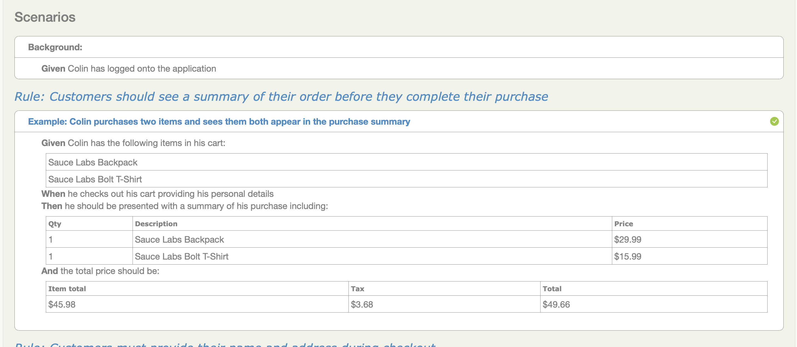

# Introducción

Serenity BDD es una biblioteca de código abierto que busca hacer realidad la idea de la documentación viva.

Serenity BDD te ayuda a escribir pruebas de aceptación y regresión automatizadas más limpias y mantenibles de forma más rápida. Serenity también usa los resultados de las pruebas para producir reportes ilustrados y narrativos que documentan y describen lo que hace tu aplicación y cómo funciona. Serenity te dice no solo qué pruebas se han ejecutado, sino más importante aún, qué requisitos se han probado.

Una ventaja clave de usar Serenity BDD es que no tienes que invertir tiempo en construir y mantener tu propio framework de automatización. Serenity BDD proporciona un fuerte soporte para diferentes tipos de pruebas de aceptación automatizadas, incluyendo:
- Pruebas web con Selenium.
- Pruebas de API REST con RestAssured.
- Pruebas automatizadas altamente legibles, mantenibles y escalables con el Screenplay Pattern.
- Especificaciones ejecutables estilo BDD con Cucumber

Serenity no solo reporta qué requisitos fueron probados, también reporta _cómo_ fueron probados. Incluye detalles paso a paso de cómo se desarrolló una prueba, incluyendo capturas de pantalla opcionales, para que tus pruebas realmente documenten lo que hace tu aplicación.

Pero Serenity no es solo sobre reportes. El objetivo subyacente de Serenity es facilitar la escritura rápida de criterios de aceptación automatizados bien estructurados y mantenibles, usando tu biblioteca favorita de BDD o pruebas convencionales. Puedes trabajar con herramientas de Desarrollo Guiado por Comportamiento (BDD) como Cucumber, o simplemente usar JUnit (4 o 5). Puedes integrarte con requisitos almacenados en una fuente externa (como JIRA o cualquier otra herramienta de gestión de casos de prueba), o simplemente usar un enfoque basado en directorios para organizar tus requisitos.

Serenity también proporciona una gran cantidad de funcionalidades incorporadas que hacen que codificar tu automatización de pruebas sea más rápido y confiable. Los testers que trabajan con Serenity típicamente reportan automatizar pruebas con menos de la mitad del código que necesitarían para una prueba convencional de Selenium.

:::info
Hasta noviembre de 2014, Serenity se conocía con el nombre de Thucydides. Tucídides fue un historiador de la Antigua Grecia que escribió sobre la Guerra del Peloponeso a finales del siglo V a.C. Fue el primer historiador en escribir sobre eventos en los que realmente participó, y en muchos casos, escribió los eventos que presenció directamente.

De manera similar, Serenity BDD no solo reporta los resultados de las pruebas, sino que también registra y documenta cómo se desarrolla cada escenario, proporcionando una forma particularmente rica de reportes de pruebas y documentación viva.
:::

