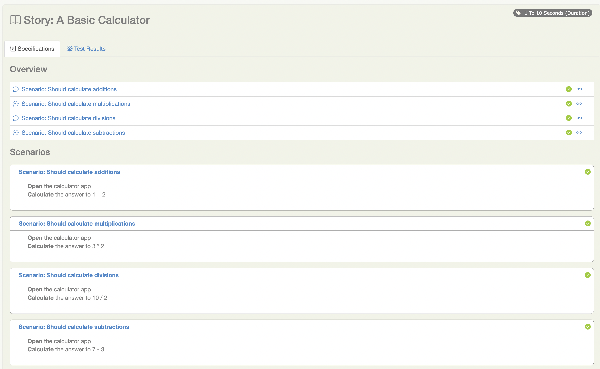
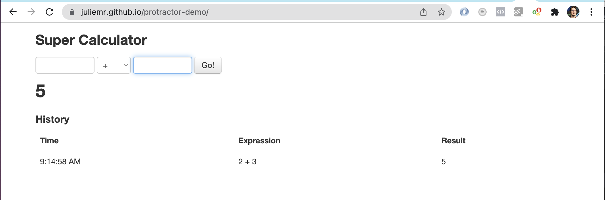

# Bibliotecas de Pasos de Serenity
En Serenity, las pruebas se dividen en pasos reutilizables. Un principio importante detrás de Serenity es la idea de que es más fácil mantener una prueba que usa varias capas de abstracción para ocultar la complejidad detrás de diferentes partes de una prueba.

En una prueba de aceptación automatizada, los pasos de prueba representan el nivel de abstracción entre el código que interactúa con tu aplicación (por ejemplo, Page Component Object en una prueba web automatizada, que modelan partes de la interfaz de usuario, o endpoints de API para servicios web con los que necesitas interactuar) y las historias de nivel más alto (secuencias de acciones más enfocadas en el negocio que ilustran cómo se ha implementado una historia de usuario dada). Si tu prueba automatizada no está orientada a la UI (por ejemplo, si llama a un servicio web), los pasos orquestan otros componentes más técnicos como clientes REST. Los pasos pueden contener otros pasos, y se incluyen en los reportes de Serenity. Cada vez que se ejecuta un paso de UI, se almacena una captura de pantalla y se muestra en el reporte.

## Dividiendo las pruebas en pasos
Supongamos que estamos probando un programa de Viajero Frecuente, y necesitamos ilustrar las siguientes reglas de negocio:

- Los miembros deben comenzar con estado Bronze
- Los miembros deben ganar estado Silver después de volar 10,000 km.

Cada una de estas puede dividirse aún más en tareas y verificaciones de negocio. Por ejemplo, la primera regla podría dividirse en dos pasos:
- Crear un nuevo miembro de Viajero Frecuente
- Verificar que el miembro tiene un estado de Bronze

Y la segunda puede dividirse en tres pasos:
- Crear un nuevo miembro de Viajero Frecuente
- Hacer que el miembro vuele 10000 km
- Verificar que el miembro tiene un estado de Silver

Podríamos expresar estas pruebas usando Serenity en JUnit 5 de la siguiente manera:

```java
package flyer;

import net.serenitybdd.junit5.SerenityJUnit5Extension;
import net.thucydides.core.annotations.Steps;
import org.junit.jupiter.api.Test;
import org.junit.jupiter.api.extension.ExtendWith;
import flyer.steps.TravellerEarningStatusPoints;

import static flyer.Status.Bronze;
import static flyer.Status.Silver;

@ExtendWith(SerenityJUnit5Extension.class)
class WhenEarningFrequentFlyerPoints {

    @Steps
    TravellerEarningStatusPoints tracy;

    @Test
    void members_should_start_with_Bronze_status() {
        // GIVEN
        tracy.joins_the_frequent_flyer_program();

        // THEN
        tracy.should_have_a_status_of(Bronze);
    }

    @Test
    void earn_silver_after_10000_kilometers() {
        // GIVEN
        tracy.joins_the_frequent_flyer_program();

        // WHEN
        tracy.flies(10000);

        // THEN
        tracy.should_have_a_status_of(Silver);
    }
}
```

:::note JUnit 4 Obsoleto
Si aún estás usando JUnit 4 con `@RunWith(SerenityRunner.class)`, ten en cuenta que el soporte de JUnit 4 está obsoleto a partir de Serenity 5.0.0 y será eliminado en Serenity 6.0.0. Por favor migra a JUnit 5 usando `@ExtendWith(SerenityJUnit5Extension.class)` como se muestra arriba.
:::

Observa cómo la segunda prueba reutiliza métodos de pasos usados en la primera para realizar una prueba ligeramente diferente. Este es un ejemplo típico de la manera en que reutilizamos pasos en pruebas similares, para evitar código duplicado y hacer el código más fácil de mantener.

## Implementando Bibliotecas de Pasos Simples
La clase `TravellerEarningStatusPoints` es lo que llamamos una biblioteca de pasos. Usamos la clase `@Steps` como se muestra arriba para indicar una biblioteca de pasos en nuestro código de prueba: esta anotación le dice a Serenity que instancie e instrumente este campo, para que los métodos que llames en esta biblioteca también aparezcan en los reportes de prueba.

Las bibliotecas de pasos contienen las tareas de negocio o acciones que un usuario realiza durante una prueba. Hay muchas formas de organizar tus bibliotecas de pasos, pero una forma conveniente es agrupar métodos en porciones de comportamiento de negocio para un tipo dado de usuario. En este caso un viajero que está ganando puntos de estado.

Observa que no fue necesario instanciar explícitamente la clase de pasos `TravellerEarningStatusPoints`. Cuando anotas una variable miembro de esta clase con la anotación `@Steps`, Serenity BDD la instanciará automáticamente por ti.

Nunca debes crear instancias de bibliotecas de pasos usando la palabra clave `new`, ya que Serenity no podrá instrumentar la biblioteca de pasos correctamente, y los métodos llamados no aparecerán en los reportes.

Por ejemplo, supongamos que queremos probar una UI de calculadora simple. En esta clase, usamos la biblioteca de pasos `CalculatorSteps`, que anotamos con la anotación `@Steps`:

```java
@ExtendWith(SerenityJUnit5Extension.class)
class WhenDoingSums {

    @Steps
    CalculatorSteps calulate;

    @Nested
    class ABasicCalculator {

        @BeforeEach
        void openTheCalculator() {
            calulate.openTheCalculatorApp();
        }

        @Test
        void shouldCalculateAdditions() {
            int result = calulate.theAnswerTo("1","+","2");
            assertThat(result).isEqualTo(3);
        }

        @Test
        void shouldCalculateSubtractions() {
            int result = calulate.theAnswerTo("7","-","3");
            assertThat(result).isEqualTo(4);
        }

        @Test
        void shouldCalculateMultiplications() {
            int result = calulate.theAnswerTo("3","*","2");
            assertThat(result).isEqualTo(6);
        }

        @Test
        void shouldCalculateDivisions() {
            int result = calulate.theAnswerTo("10","/","2");
            assertThat(result).isEqualTo(5);
        }
    }
}
```

La clase `CalculatorSteps` define los pasos que un usuario necesita realizar - en este caso, realizar un cálculo en la aplicación de calculadora:

```java
public class CalculatorSteps {

    @Step("Calculate the answer to {0} {1} {2}")
    public int theAnswerTo(String a, String operator, String b) {
        // Interactuar con la calculadora para realizar el cálculo
    }
}
```

Los métodos de paso están anotados con la anotación `@Step`, que le dice a Serenity que incluya este método en los reportes de prueba de Serenity. El valor que incluimos en la anotación `@Step` es el texto que aparecerá en los reportes de Serenity cuando este paso se ejecute. Los números entre llaves (`{0}`,`{1}` y `{2}`) representan marcadores de posición para los parámetros del método, si queremos que aparezcan en los reportes.

Cuando ejecutamos este caso de prueba, Serenity documentará los pasos que se ejecutan durante cada prueba, produciendo una documentación viva de la ejecución de la prueba:



### Clases de Interacción de UI

Supongamos que nuestra prueba de calculadora necesita interactuar con una UI web, como la de https://juliemr.github.io/protractor-demo/ mostrada aquí:



Podemos acceder a la potente integración de Selenium de Serenity BDD en nuestras bibliotecas de pasos extendiendo la clase `net.serenitybdd.core.steps.UIInteractions`. Una implementación muy simple podría verse así:

```java
public class CalculatorSteps extends UIInteractions {

     @Step
    public void openTheCalculatorApp() {
        openUrl("https://juliemr.github.io/protractor-demo/");
    }

   @Step("Calculate the answer to {0} {1} {2}")
    public int theAnswerTo(String firstValue, String operator, String secondValue) {

        $("[ng-model=first]").sendKeys(firstValue);
        $("[ng-model=operator]").selectByVisibleText(operator);
        $("[ng-model=second]").sendKeys(secondValue);
        $("#gobutton").click();
        waitForAngularRequestsToFinish();

        return Integer.parseInt($("css:h2").getText());
    }
}
```

Una implementación más legible y refactorizada podría verse así:

```java
public class CalculatorSteps extends UIInteractions {

    private static final By FIRST_VALUE_FIELD = By.cssSelector("[ng-model=first]");
    private static final By SECOND_VALUE_FIELD = By.cssSelector("[ng-model=second]");
    private static final By OPERATOR_DROPDOWN = By.cssSelector("[ng-model=operator]");
    private static final By GO_BUTTON = By.id("gobutton");
    private static final By RESULT_FIELD = By.tagName("h2");
    private static final Pattern A_VALID_NUMBER = Pattern.compile("-?\\d\\.?d*");

    @Step
    public void openTheCalculatorApp() {
        openUrl("https://juliemr.github.io/protractor-demo/");
    }

    @Step("Calculate the answer to {0} {1} {2}")
    public int theAnswerTo(String firstValue, String operator, String secondValue) {

        $(FIRST_VALUE_FIELD).sendKeys(firstValue);
        $(OPERATOR_DROPDOWN).selectByVisibleText(operator);
        $(SECOND_VALUE_FIELD).sendKeys(secondValue);
        $(GO_BUTTON).click();
        waitFor(ExpectedConditions.textMatches(RESULT_FIELD,A_VALID_NUMBER));

        return Integer.parseInt($(RESULT_FIELD).getText());
    }
}
```

Las pruebas ahora interactuarán con la interfaz de usuario, reportarán tanto los pasos ejecutados como (si está configurado para hacerlo) grabarán capturas de pantalla para cada paso:


### Bibliotecas de Pasos de Persona

Otro enfoque para modelar bibliotecas de pasos gira en torno a actores y roles. Volvamos a nuestro ejemplo original: Tracy, la viajera, que gana puntos cuando viaja.

```java
public class TravellerEarningStatusPoints {

    private String actor;

    private FrequentFlyer frequentFlyer;

    @Step("#actor joins the frequent flyer program")
    public void joins_the_frequent_flyer_program() {
        frequentFlyer = FrequentFlyer.withInitialBalanceOf(0);
    }

    @Step("#actor flies {0} km")
    public void flies(int distance) {
        frequentFlyer.recordFlightDistanceInKilometers(distance);
    }

    @Step("#actor should have a status of {0}")
    public void should_have_a_status_of(Status expectedStatus) {
        assertThat(frequentFlyer.getStatus()).isEqualTo(expectedStatus);
    }

    @Step("#actor transfers {0} points to {1}")
    public void transfers_points(int points, TravellerEarningStatusPoints otherFrequentFlier) {
        // Dejado como ejercicio
    }

    @Override
    public String toString() {
        return actor;
    }

    @Step("#actor should have {0} points")
    public void should_have_points(int expectedPoints) {
        // Dejado como ejercicio
    }
}
```

Este enfoque usa el concepto de bibliotecas de pasos de _persona_, donde una biblioteca de pasos representa las acciones de un usuario específico realizando una tarea específica (Tracy la viajera que está ganando puntos). En este caso, Serenity instanciará automáticamente el campo _actor_ con el nombre de la variable de la biblioteca de pasos (`tracy`), permitiendo que aparezca en los reportes de prueba para hacerlos más legibles:


## Instancias Compartidas de Bibliotecas de Pasos
Hay algunos casos donde queremos reutilizar la misma instancia de biblioteca de pasos en diferentes lugares a través de una prueba. Por ejemplo, supongamos que tenemos una biblioteca de pasos que interactúa con una API backend, y que mantiene algún estado interno y caché para mejorar el rendimiento. Podríamos querer reutilizar una sola instancia de esta biblioteca de pasos, en lugar de tener una instancia separada para cada variable.

Podemos hacer esto declarando la biblioteca de pasos como compartida, así:

```java
@Steps(shared = true)
CustomerAPIStepLibrary customerAPI;
```

Ahora, cualquier otra biblioteca de pasos de tipo `CustomerAPIStepLibrary`, que tenga el atributo shared establecido a true se referirá a la misma instancia.

En versiones anteriores de Serenity, compartir instancias era el comportamiento por defecto, y usabas el atributo uniqueInstance para indicar que una biblioteca de pasos no debía ser compartida. Si necesitas forzar este comportamiento para suites de pruebas heredadas, establece la propiedad step.creation.strategy a legacy en tu archivo serenity.properties:

```javascript
step.creation.strategy = legacy
```
