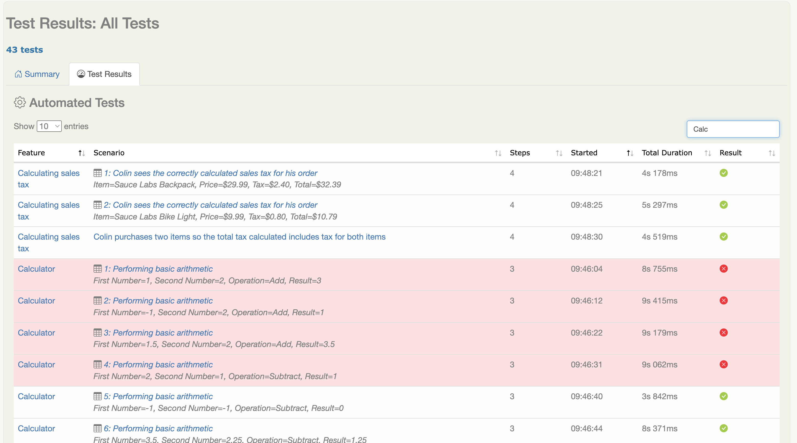

Los reportes de Serenity son una característica particularmente poderosa de Serenity BDD. Su objetivo no es solo _reportar_ resultados de pruebas, sino también _documentar_ cómo se prueban las funcionalidades y qué hace la aplicación.

## Vista general de los resultados de pruebas

Un reporte típico de Serenity se muestra a continuación:


Este muestra un gráfico de pastel simple que presenta la distribución de resultados de pruebas, y gráficos de barras que indican los resultados de las pruebas ordenados por resultado y por duración.

Las líneas onduladas en las barras naranjas (que indican pruebas con errores) son para accesibilidad. Para activarlas, necesitas la siguiente configuración en tu archivo `serenity.conf`:

```hocon
serenity {
    report {
       accessibility = true
    }
}
```

## Cobertura Funcional de Pruebas

Más abajo en la pantalla encontrarás la sección de Cobertura Funcional de Pruebas:


Esta sección ofrece un desglose por capacidad (o por cómo hayas decidido agrupar tus funcionalidades). Puedes definir los tipos de requisitos utilizados en tu proyecto usando la propiedad `serenity.requirement.types`, por ejemplo:

```hocon
serenity {
  requirement {
    types = "epic, feature"
  }
}
```
Ten en cuenta que para Cucumber, el nivel más bajo siempre se definirá como _Feature_.

La sección de _Estadísticas Clave_ muestra los tiempos de ejecución y el número total de escenarios de prueba y casos de prueba. Puedes definir los rangos de valores de duración que aparecen en el reporte usando la propiedad `serenity.report.durations`:

```hocon
serenity{
  report {
    durations = "1,2,4,8,15,30,60"
  }
}
```

Serenity distingue entre _Escenarios de Prueba_ más generales y _Casos de Prueba_ más específicos.

Un escenario simple o una prueba JUnit cuenta como un escenario con un solo caso de prueba. Por ejemplo, considera el siguiente escenario:

```gherkin
Scenario: Colin logs in with Colin's valid credentials
    Given Colin is on the login page
    When Colin logs in with valid credentials
    Then he should be presented the product catalog
```

Esto cuenta como 1 escenario con 1 caso de prueba.

| Escenarios | Casos de Prueba |
|------------|-----------------|
| 1          | 1               |

Un Scenario Outline, por otro lado, es un único escenario con muchos casos de prueba. Así que si tuvieras el siguiente Scenario Outline:

```gherkin
    Scenario Outline: Login's with invalid credentials for <username>
      Given Colin is on the login page
      When Colin attempts to login with the following credentials:
        | username   | password   |
        | <username> | <password> |
      Then he should be presented with the error message <message>
      Examples:
        | username        | password       | message                                                     |
        | standard_user   | wrong_password | Username and password do not match any user in this service |
        | unknown_user    | secret_sauce   | Username and password do not match any user in this service |
        | unknown_user    | wrong_password | Username and password do not match any user in this service |
        | locked_out_user | secret_sauce   | Sorry, this user has been locked out                        |
```

Entonces el reporte de pruebas incluiría 1 escenario pero 4 casos de prueba:

| Escenarios | Casos de Prueba |
|------------|-----------------|
| 1          | 4               |

Así que una suite de pruebas que contiene ambos escenarios incluiría 2 escenarios compuestos por 5 casos de prueba:

| Escenarios | Casos de Prueba |
|------------|-----------------|
| 2          | 5               |

## Detalles de Cobertura Funcional

Más abajo se muestran los resultados de cobertura funcional con mayor detalle:


Esto lista los requisitos por categoría. Por defecto, los resultados de Cucumber organizados en carpetas bajo `src/test/resources/features` se organizarán por Capacidades y Feature. Como se mencionó anteriormente, puedes personalizar estas categorías usando la propiedad `serenity.requirement.types`.


## Resultados de Pruebas

La pestaña de Resultados de Pruebas lista los resultados reales de las pruebas:



Para pruebas basadas en datos y Scenario Outline, cada fila de datos se reporta como un resultado de prueba separado, y se marca con un ícono de tabla para indicar que es un resultado de prueba basada en datos.

## Errores y Etiquetas

La última sección del reporte lista las causas más frecuentes de fallos en las pruebas:


Esta sección también menciona cuáles son las funcionalidades que contienen más pruebas fallidas. Puedes ver qué pruebas fallan por una razón determinada haciendo clic en la etiqueta de _error_ correspondiente justo debajo de esta sección.

También lista las etiquetas que aparecen en las funcionalidades. Puedes excluir etiquetas que no quieres que aparezcan en esta sección (por ejemplo, etiquetas técnicas) usando la propiedad `serenity.report.exclude.tags`, por ejemplo:
```
serenity {
    report {
        exclude.tags = "resetappstate,singlebrowser,manual"
    }
}
```
