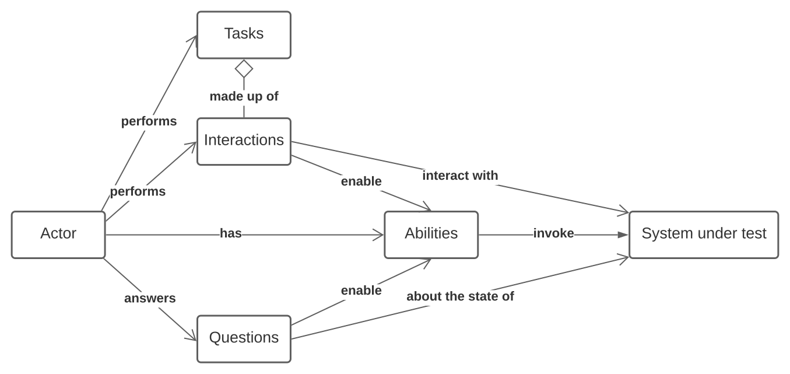

# Fundamentos de Screenplay

El Screenplay Pattern es un patrón de diseño moderno para automatizacion de pruebas, pensado para facilitar la escritura de codigo de pruebas escalable y mantenible. Puedes obtener una vista rapida de un test Screenplay simple [aqui](../../docs/tutorials/screenplay).

En esta seccion, veremos como escribir automatizacion de pruebas de alta calidad usando el Screenplay Pattern con mas detalle. Inicialmente nos enfocaremos en interactuar con una aplicacion web usando Selenium - en las siguientes secciones, veremos como interactuar con APIs y bases de datos usando el modelo Screenplay.

En Screenplay modelamos _actores_ (Actor) que interactuan con una aplicacion de varias formas para realizar _tareas_ (Task) que les ayudan a alcanzar sus objetivos. Los Actor tienen _habilidades_ (Ability), como la habilidad de interactuar con un navegador web o consultar una base de datos, que les ayudan a realizar estas tareas. Los Actor tambien pueden responder _preguntas_ (Question) sobre el estado del sistema, para que podamos verificar si una funcionalidad se comporta como esperamos.



## Configurando un test Screenplay
Los tests de Serenity BDD Screenplay pueden escribirse usando cualquier framework que funcione con Serenity BDD. Comenzaremos discutiendo como configurar un caso de prueba Serenity Screenplay simple usando bibliotecas comunes como JUnit 4, JUnit 5 y Cucumber.

### Screenplay y JUnit 4

Ejecutar un test Screenplay en JUnit 4 y JUnit 5 no es diferente de cualquier otro test de Serenity BDD. Para JUnit 4, agrega la dependencia `serenity-junit` a tu proyecto si aun no esta:
```xml
        <dependency>
            <groupId>net.serenity-bdd</groupId>
            <artifactId>serenity-junit</artifactId>
            <version>${serenity.version}</version>
            <scope>test</scope>
        </dependency>
        <dependency>
            <groupId>net.serenity-bdd</groupId>
            <artifactId>serenity-screenplay</artifactId>
            <version>${serenity.version}</version>
            <scope>test</scope>
        </dependency>
        <dependency>
            <groupId>net.serenity-bdd</groupId>
            <artifactId>serenity-screenplay-webdriver</artifactId>
            <version>${serenity.version}</version>
            <scope>test</scope>
        </dependency>
```

### Screenplay y JUnit 5 (Recomendado)

Para JUnit 5, agrega la siguiente dependencia a tu proyecto:
```xml
        <dependency>
            <groupId>net.serenity-bdd</groupId>
            <artifactId>serenity-junit5</artifactId>
            <version>${serenity.version}</version>
            <scope>test</scope>
        </dependency>
        <dependency>
            <groupId>net.serenity-bdd</groupId>
            <artifactId>serenity-screenplay</artifactId>
            <version>${serenity.version}</version>
            <scope>test</scope>
        </dependency>
        <dependency>
            <groupId>net.serenity-bdd</groupId>
            <artifactId>serenity-screenplay-webdriver</artifactId>
            <version>${serenity.version}</version>
            <scope>test</scope>
        </dependency>
```
A continuacion, necesitas usar la clase `SerenityJUnit5Extension`, asi:
```java
import net.serenitybdd.junit.runners.SerenityJUnit5Extension;
import org.junit.jupiter.api.Test;

@ExtendWith(SerenityJUnit5Extension.class)
class AddNewTodos {

    @Test
    @DisplayName("Add a todo item to an empty list")
    void addToEmptyList() {...}
}
```

### Screenplay y JUnit 4 (Obsoleto)

:::warning JUnit 4 Obsoleto
El soporte para JUnit 4 esta obsoleto desde Serenity 5.0.0 y sera eliminado en Serenity 6.0.0. Por favor migra a JUnit 5 (ver arriba).
:::

Si aun usas JUnit 4, usa la clase `SerenityRunner` en tu clase de test, asi:

```java
import net.serenitybdd.junit.runners.SerenityRunner;
import org.junit.Test;

@RunWith(SerenityRunner.class)
public class AddNewTodos {

    @Test
    public void addToEmptyList() {...}
}
```

### Screenplay y Cucumber

Para ejecutar un Scenario Screenplay con Cucumber y Serenity, solo necesitas las dependencias estandar de Screenplay junto con la dependencia `serenity-cucumber`, como se muestra a continuacion:
```xml
        <dependency>
            <groupId>net.serenity-bdd</groupId>
            <artifactId>serenity-cucumber</artifactId>
            <version>${serenity.version}</version>
            <scope>test</scope>
        </dependency>
        <dependency>
            <groupId>net.serenity-bdd</groupId>
            <artifactId>serenity-screenplay</artifactId>
            <version>${serenity.version}</version>
            <scope>test</scope>
        </dependency>
        <dependency>
            <groupId>net.serenity-bdd</groupId>
            <artifactId>serenity-screenplay-webdriver</artifactId>
            <version>${serenity.version}</version>
            <scope>test</scope>
        </dependency>
```

#### Con JUnit 5 (Recomendado)

Para JUnit 5, usa la anotacion `@Suite` con el Cucumber JUnit Platform Engine:

```java
import org.junit.platform.suite.api.*;

import static io.cucumber.junit.platform.engine.Constants.PLUGIN_PROPERTY_NAME;

@Suite
@IncludeEngines("cucumber")
@SelectClasspathResource("features")
@ConfigurationParameter(
    key = PLUGIN_PROPERTY_NAME,
    value = "net.serenitybdd.cucumber.core.plugin.SerenityReporterParallel"
)
class TestSuite {}
```

#### Con JUnit 4 (Obsoleto)

:::warning JUnit 4 Obsoleto
Los runners de JUnit 4 para Cucumber estan obsoletos desde Serenity 5.0.0 y seran eliminados en Serenity 6.0.0. Por favor migra a JUnit 5 (ver arriba).
:::

Para JUnit 4, usarias:

```java
import io.cucumber.junit.CucumberOptions;
import net.serenitybdd.cucumber.CucumberWithSerenity;
import org.junit.runner.RunWith;

@RunWith(CucumberWithSerenity.class)
@CucumberOptions(
        features = "classpath:features"
)
public class TestSuite {}
```

## Definiendo los Actor

Todo test Screenplay necesita al menos un Actor (y algunos tienen varios). Hay varias formas de definir un Actor, que varian ligeramente dependiendo del framework de test que estes usando.

### Actor en JUnit

Una forma de crear un nuevo Actor es usar el metodo `Actor.named()`. Por ejemplo, para crear un Actor llamado Toby, podriamos escribir lo siguiente:

```java
Actor toby = Actor.named("Toby");
```

Sin embargo, este Actor no podra hacer mucho hasta que le demos la habilidad de interactuar con nuestra aplicacion. Ahi es donde entran en juego las _habilidades_ (Ability).

La Ability mas comunmente necesaria es la habilidad de navegar por la web usando una biblioteca de automatizacion web como Selenium o Playwright. En un test Serenity JUnit, podemos usar la anotacion `@Managed` para gestionar el ciclo de vida del WebDriver. Una vez que tenemos un driver disponible, podemos asignarlo a un Actor usando la clase `BrowseTheWeb` asi:

```java
@ExtendWith(SerenityJUnit5Extension.class)
class AddNewTodosWithAManagedDriver {

    @Managed
    WebDriver driver;

    @Test
    @DisplayName("Add a todo item to an empty list")
    void addToEmptyList() {
        Actor toby = Actor.named("Toby")
                          .whoCan(BrowseTheWeb.with(driver));
    ...
    }
}
```

### Definiendo Actor usando la anotacion CastMember

Para muchos escenarios podemos simplificar el codigo mostrado arriba. Si solo necesitamos usar un Actor que pueda interactuar con un sitio web usando Selenium, podemos usar la anotacion `@CastMember`. Esta anotacion configurara un Actor con una instancia de WebDriver, y gestionara el ciclo de vida del navegador por nosotros (asi que no hay necesidad de la anotacion `@Managed` o la variable `WebDriver`). Puedes ver un ejemplo de esta anotacion en accion aqui:

```java
@ExtendWith(SerenityJUnit5Extension.class)
class AddNewTodosWithACastMember {

    @CastMember
    Actor toby;

    @Test
    @DisplayName("Add a todo item to an empty list")
    void addToEmptyList() {

        toby.attemptsTo(
                Open.browserOn().the(TodoMvcPage.class),
                Enter.theValue("Buy some milk").into(".new-todo").thenHit(Keys.RETURN)
        );
        Collection<String> items = toby.asksFor(Text.ofEach(".todo-list label"));
        assertThat(items).containsExactly("Buy some milk");

        String title = toby.asksFor(Text.of(By.tagName("h1")));
        assertThat(title).isEqualTo("todos");
    }
}
```

El nombre del Actor se derivara del nombre de la variable. Si necesitas un nombre mas descriptivo, puedes usar el atributo `name` para proporcionar un valor de texto libre, que se usara en los reportes:

```java
    @CastMember(name = "Tim the Enchanter")
    Actor tim;
```

### Actor en Cucumber

Configurar Actor en Cucumber es un poco mas complicado que en JUnit, porque generalmente nos referimos a ellos por nombre en los Scenario de Cucumber. Supongamos por ejemplo que queremos automatizar el siguiente Scenario:

```gherkin
  Scenario: Add items to an empty list
    Given Toby starts with an empty list
    When he adds "Buy some milk" to his list
    Then the todo list should contain the following items:
      | Buy some milk |
```

#### Usando un driver Managed con Cucumber
Podemos usar el mismo enfoque que usamos para JUnit en nuestros archivos de Step Definition de Cucumber, declarando una instancia de Webdriver usando la anotacion `@Managed` y asignandola a nuestro Actor usando la clase de Ability `BrowseTheWeb`:

```java
public class TodoStepDefinitions {

    @Managed
    WebDriver driver;

    Actor toby = Actor.named("Toby");

    @Before
    public void setupActor() {
        toby.can(BrowseTheWeb.with(driver));
    }

    @Given("Toby starts with an empty list")
    public void stats_with_an_empty_list() {
        toby.attemptsTo(
                Open.url("https://todomvc.com/examples/angularjs/#/")
        );
    }
```

Sin embargo, el nombre del Actor ("Toby") es parte de los pasos del Scenario. Podriamos querer tener otros Scenario con otros Actor, o tener un Scenario que involucre mas de un Actor.

#### Cast y Stage
Podemos hacer nuestras Step Definition de Cucumber mas flexibles introduciendo el concepto de un _Cast_ (elenco) de Actor, y un _Stage_ (escenario) donde actuan.

Un _Cast_ es una clase cuyo trabajo es proporcionar Actor con un conjunto especifico de Ability, cuando los necesitamos para desempenar un papel en nuestros tests. Por ejemplo, podemos usar la clase `OnlineCast` para proporcionar Actor que estan equipados con sus propias instancias de Webdriver. De esta forma, no necesitamos declarar el driver `@Managed`, y cada Actor puede tener su propio navegador si tenemos un Scenario con mas de un Actor.

Un _Stage_ es donde nuestros Actor desempenan sus roles. Un Scenario tiene un unico Stage, que podemos usar para identificar un Actor por nombre o encontrar el Actor actualmente activo.

Necesitamos asignar un Cast al Stage al inicio de cada Scenario; podemos hacer esto llamando al metodo `OnStage.setTheStage()` y pasando un Cast especifico, asi:

```java
OnStage.setTheStage(new OnlineCast());
```

Una vez que hemos configurado el Stage, podemos obtener un Actor con un nombre dado usando el metodo `OnStage.theActorCalled()`, asi:
```java
Actor toby = OnStage.theActorCalled("Toby");
```

Usando este enfoque, podriamos implementar el primer paso de nuestro Scenario de una manera que funcione sin importar que Actor este involucrado, asi:
```java
    @Given("{word} starts with an empty list")
    public void stats_with_an_empty_list(String actorName) {
        Actor actor = OnStage.theActorCalled(actorName);
        actor.attemptsTo(
                Open.url("https://todomvc.com/examples/angularjs/#/")
        );
    }
```

A menudo es util definir una expresion de Cucumber personalizada para no tener que llamar al metodo `OnStage.theActorCalled()` cada vez:
```java
    @ParameterType(".*")
    public Actor actor(String actorName) {
        return OnStage.theActorCalled(actorName);
    }

    @Given("{actor} starts with an empty list")
    public void stats_with_an_empty_list(Actor actor) {
        actor.attemptsTo(
                Open.url("https://todomvc.com/examples/angularjs/#/")
        );
    }
```

De esta forma, nuestro siguiente paso puede simplemente usar un parametro de tipo `Actor`, asi:
```java
    @When("{actor} adds {string} to his list")
    public void he_adds_to_his_list(Actor actor, String item) {
        actor.attemptsTo(
                Enter.theValue(item).into(".new-todo").thenHit(Keys.RETURN)
        );
    }
```

Estos metodos estan definidos de forma predeterminada con la plantilla Serenity Cucumber Starter en Github, asi que no necesitas agregarlos tu mismo si estas usando esta plantilla.

La clase `OnStage` tambien reconoce pronombres - cuando una expresion como "he adds 'Walk the dog' to the todo list" o "her shopping cart should be empty", el metodo `theActorCalled()` reconocera el pronombre y obtendra el ultimo Actor activo con el metodo `theActorInTheSpotlight()`. Por defecto, los pronombres son:
    - he
    - she
    - they
    - it
    - his
    - her
    - their
    - its
Puedes definir tu propia lista de pronombres usando la propiedad Serenity `screenplay.pronouns` en el archivo `serenity.conf`, por ejemplo:

```conf
screenplay.pronouns=il,elle,ils,elles,son,sa,leur,leurs
```

#### Cast y Ability

En el codigo anterior, usamos la clase `OnlineCast` para definir el Cast de Actor:

```java
OnStage.setTheStage(new OnlineCast());
```

Los Cast son muy flexibles, y podemos configurarlos para producir Actor con Ability adicionales si lo necesitamos.

Por ejemplo, imagina que queremos dar a nuestros Actor la habilidad de entregar cafe. Para hacer esto, podemos crear una clase de Ability `Deliver`. Para entregar un cafe, llamaremos al metodo `deliverItem()`, que (para nuestros propositos) simplemente devolvera una cadena con un articulo con un numero unico (como "Coffee #1").

La clase Ability podria verse asi:

```java
    public class Deliver implements Ability {
        final String item;
        private int counter = 1;

        private Deliver(String item) {
            this.item = item;
        }

        public static some(String item) {
            return new Deliver(item)
        }

        public String deliverItem() {
            return item + " #" + counter++;
        }
    }
```

Ahora podemos asignar esta Ability a nuestros Actor en el `Cast` usando el metodo `Cast.whereEveryoneCan()`:

```java
OnStage.setTheStage(
    Cast.whereEveryoneCan(Fetch.some("Coffee"))
);
```

Si necesitamos una configuracion mas compleja, tambien podemos usar una expresion Lambda para proporcionar el codigo que necesitamos ejecutar para mejorar un nuevo Actor con Ability adicionales, asi:

```java
Consumer<Actor> fetchTheCoffee = { actor -> actor.whoCan(Fetch.some("Coffee")) }

OnStage.setTheStage(
    Cast.whereEveryoneCan(fetchTheCoffee)
);
```


#### El Actor en el centro de atencion

A veces un paso no se refiere a un Actor por nombre, sino que se refiere implicitamente al ultimo Actor que hizo algo en el Scenario. Por ejemplo, el tercer paso, "Then the todo list should contain the following items..." no tiene un Actor explicito.

En estas situaciones, podemos usar el metodo `OnStage.theActorInTheSpotlight()` para referirnos al ultimo Actor activo conocido. Por ejemplo, podriamos implementar el tercer paso de nuestro Scenario asi:

```java
    @Then("the todo list should contain the following items:")
    public void the_todo_list_should_contain(List<String> expectedItems) {
        Actor currentActor = OnStage.theActorInTheSpotlight();
        var todos = currentActor.asksFor(Text.ofEach(".todo-list li"));
        assertThat(todos).containsExactlyElementsOf(expectedItems);
    }
```

## Agrupando Interaction en Task

Screenplay tiene como objetivo facilitar la escritura de codigo de automatizacion mantenible y escalable. Y una forma importante de hacerlo es agrupando Interaction en secuencias reutilizables que representan conceptos de dominio de nivel superior.

Por ejemplo, el siguiente test muestra como iniciar sesion en el sitio de prueba https://www.saucedemo.com/:

```java
        toby.attemptsTo(
                Open.url("https://www.saucedemo.com/"),
                Enter.theValue("standard_user").into("#user-name"),
                Enter.theValue("secret_sauce").into("#password"),
                Click.on("#login-button")
        );
```

Estas cuatro lineas involucran todo el proceso de iniciar sesion en el sitio. Sin embargo, es dificil ver eso a simple vista al leer el codigo. Podriamos hacer este codigo mucho mas legible agrupando estas Interaction en un unico Task.

### Agrupando Interaction usando la clase Task
Un mejor enfoque seria agrupar estas Interaction relacionadas en un unico `Task`.

La forma mas simple de hacer esto es usar el metodo `Task.where()`. Este metodo nos permite devolver un Task (o mas precisamente, una implementacion de la interfaz `Performable`) que combina varios otros Task o Interaction.

El Task que permite a un Actor iniciar sesion como usuario estandar podria verse asi:

```java
public class Login {
    public static Task asAStandardUser() {
        return Task.where(
                Open.url("https://www.saucedemo.com/"),
                Enter.theValue("standard_user").into("#user-name"),
                Enter.theValue("secret_sauce").into("#password"),
                Click.on("#login-button")
        );
    }
}
```

Podriamos querer hacer nuestro Task mas configurable, agregando algunos parametros a la firma del metodo. En este caso, es util hacer nuestro Task mas descriptivo agregando una descripcion de texto antes de la lista de _Performable_, como se muestra a continuacion. Esta descripcion aparecera en los reportes cada vez que se ejecute el Task. El `{0}` en la descripcion sera reemplazado por el nombre del Actor (asi que "Toby" en nuestro test).

```java
public class Login {
    public static Performable as(String username, String password) {
        return Task.where(
                "{0} logs in as " + username,
                Open.url("https://www.saucedemo.com/"),
                Enter.theValue(username).into("#user-name"),
                Enter.theValue(password).into("#password"),
                Click.on("#login-button")
        );
    }
}
```

Ahora podemos refactorizar nuestro test original usando este metodo:

```java
        toby.attemptsTo(Login.asAStandardUser());
```

o

```java
        toby.attemptsTo(Login.as("standard_user","secret_sauce"));
```

### Usando expresiones lambda para crear Task personalizados

Hasta ahora hemos visto como crear un _Task_ a partir de una lista de otros Task o Interaction. Pero a veces necesitamos tener mas control sobre la logica de nuestro Task. Podemos hacer esto muy facilmente usando expresiones lambda, que nos dan control total sobre como debe funcionar nuestro Task.

Por ejemplo, imagina que hemos refactorizado nuestro ejemplo TodoMVC de arriba para usar la siguiente clase Task para abrir la aplicacion TodoMVC con una lista vacia:

```java

public class Start {
    public static Performable withAnEmptyTodoList() {
        return Task.where("{0} starts with an empty todo list",
                Open.url("https://todomvc.com/examples/angularjs/#/")
        );
    }
```

Tambien podriamos crear un Task para agregar un elemento a la lista:

```java
public class AddATodoItem {
    public static Performable called(String thingToDo) {
        return Task.where("{0} adds a todo item called " + thingToDo,
                Enter.theValue(item).into(".new-todo").thenHit(Keys.RETURN)
        );
    }
}
```

Ahora supongamos que queremos permitir que Toby comience con algunos elementos ya en su lista. Podriamos imaginar un nuevo metodo `Start.withAListContainingTheItems(...)` asi:

```java
        toby.attemptsTo(
                Start.withAListContaingTheItems("Feed the cat","Buy some bread")
        );
```

Sin embargo, para implementar este metodo, necesitamos iterar sobre la lista de elementos proporcionada, y llamar al Task `AddATodoItem` para cada uno de ellos. Podemos hacer esto usando una expresion Lambda en lugar de una lista de _Performable_. La expresion Lambda toma un Actor como parametro, y nos permite escribir bloques de codigo arbitrarios para implementar nuestro Task. Por ejemplo, el metodo `withAListContaingTheItems()` podria verse asi:

```java
    public static Performable withAListContainingTheItems(String... items) {
        return Task.where("{0} starts with a list containing " + Arrays.asList(items),
                actor -> {
                    actor.attemptsTo(Start.withAnEmptyTodoList());
                    for (String item : items) {
                        actor.attemptsTo(AddATodoItem.called(item));
                    }
                }
        );
```

La clase `Start` completa ahora se veria asi:

```java
public class Start {
    public static Performable withAnEmptyTodoList() {
        return Task.where("{0} starts with an empty todo list",
                Open.url("https://todomvc.com/examples/angularjs/#/")
        );
    }

    public static Performable withAListContainingTheItems(String... items) {
        return Task.where("{0} starts with a list containing " + Arrays.asList(items),
                actor -> {
                    actor.attemptsTo(Start.withAnEmptyTodoList());
                    for (String item : items) {
                        actor.attemptsTo(AddATodoItem.called(item));
                    }
                }
        );
    }
}

```

### Escribiendo clases Performable personalizadas

A veces necesitamos mas control sobre la creacion de un Task. Podemos hacer esto creando una clase que implemente la interfaz `Performable`.

La interfaz `Performable` tiene un unico metodo que necesitas implementar: `performAs()`. Este metodo toma un `Actor` como parametro. Un Task personalizado muy simple podria verse asi:

```java
public class AddItem implements Performable {
    @Override
    public <T extends Actor> void performAs(T actor) {
        actor.attemptsTo(
                Enter.theValue("Buy some milk")
                        .into(".new-todo")
                        .thenHit(Keys.RETURN)
        );
    }
}
```

Ahora podemos usar esta clase directamente en nuestros tests:

```java
    AddItem addANewItem = new AddItem();
    toby.attemptsTo(addANewItem);
```

Por defecto, Serenity registrara esta accion en los reportes usando el nombre del Actor y el nombre de la clase, asi que en este caso, el reporte incluiria algo como "Toby add item". Si queremos un texto mas descriptivo, podemos agregar la anotacion `@Step` al metodo `performAs()`, como se muestra aqui (el marcador "{0}" sera reemplazado por el nombre del Actor):

```java
public class AddItem implements Performable {
    @Override
    @Step("{0} adds an item to the list")
    public <T extends Actor> void performAs(T actor) {
        actor.attemptsTo(
                Enter.theValue("Buy some milk")
                        .into(".new-todo")
                        .thenHit(Keys.RETURN)
        );
    }
}
```

En esta clase, solo podemos agregar el elemento "Buy some milk" a nuestra lista. Podriamos hacer nuestra clase mas flexible registrando el nombre del Task como un parametro. Para hacer esto, necesitamos agregar una variable miembro a nuestro `Performable` para representar este valor, y pasarlo al constructor:

```java
public class AddItem implements Performable {
    private String name;

    public AddItem(String name) {
        this.name = name;
    }

    @Override
    @Step("{0} adds an item to the list")
    public <T extends Actor> void performAs(T actor) {
        actor.attemptsTo(
                Enter.theValue(name)
                        .into(".new-todo")
                        .thenHit(Keys.RETURN)
        );
    }

    public static AddItem called(String name) {
        return new AddItem(name);
    }
}
```

Ahora podemos hacer nuestro codigo de test mas legible, como se muestra aqui:
```java
    toby.attemptsTo(AddItem.named("Walk the dog"));
```

Sin embargo, hay una cosa mas que necesitamos hacer para que esto funcione correctamente. El codigo mostrado aqui no se reportara correctamente en los reportes de Serenity. Por razones tecnicas, cada implementacion de `Performable` debe tener un constructor por defecto, incluso si no lo usas directamente en tu codigo. Asi que la implementacion completa se veria asi:

```java
public class AddItem implements Performable {
    private String name;

    public AddItem() {}

    public AddItem(String name) {
        this.name = name;
    }

    @Override
    @Step("{0} adds an item to the list")
    public <T extends Actor> void performAs(T actor) {
        actor.attemptsTo(
                Enter.theValue(name)
                        .into(".new-todo")
                        .thenHit(Keys.RETURN)
        );
    }

    public static AddItem called(String name) {
        return new AddItem(name);
    }
}
```

:::tip
Recuerda siempre agregar un constructor por defecto sin parametros a tus implementaciones de `Performable`, de lo contrario no apareceran correctamente en los reportes.
:::

## Question - consultando el estado del sistema

Screenplay es un patron centrado en el Actor, y asi como los Actor interactuan con el sistema realizando _Task_ e _Interaction_, pueden consultar el estado del sistema haciendo _preguntas_ (Question).

### Usando clases Question incluidas
Un Actor puede hacer una pregunta usando el metodo `askFor()`. Puedes ver un ejemplo de como funciona esto aqui:

```java
   String pageTitle = toby.asksFor(Text.of(".title"));
```

`Text` es un ejemplo de una _Question Factory_. Las Question Factory proporcionan una forma conveniente de consultar el estado de la aplicacion, y hay muchas para elegir. Por ejemplo, podriamos verificar si un elemento web particular era visible usando la clase `Visibility`, asi:

```java
   boolean isVisible = toby.asksFor(Visibility.of(".title"));
```

Serenity BDD viene con muchas _Question Factory_ incluidas como estas, y las veremos con mas detalle en la siguiente seccion. Pero tambien puedes escribir tus propias Question personalizadas, para consultar cualquier aspecto de tu aplicacion que desees.

### Creando Question personalizadas usando expresiones Lambda
Una forma de implementar una _Question_ es usar una expresion Lambda de Java 8 que toma un _Actor_ como argumento. Por ejemplo, el siguiente metodo devuelve una _Integer Question_ (una _Question_ que devuelve un entero).

```java
    Question<Integer> numberOfTodoItems() {
        return actor -> BrowseTheWeb.as(actor).findAll(".todo-list li").size();
    }
```

Podriamos encontrar la respuesta a esta Question usando el metodo `asksFor()`, como en el ejemplo anterior:
```java
   int numberOfTodos = toby.asksFor(numberOfTodoItems());
```

Una alternativa al metodo `asksFor()` es el propio metodo `answeredBy()` de la `Question`:

```java
   int numberOfTodos = numberOfTodoItems().answeredBy(toby);
```

Este formato puede ser mas conveniente para aserciones, como se ilustra en este ejemplo:

```java
   assertThat(numberOfTodoItems().answeredBy(toby)).isEqualTo(1);
```

### Haciendo las Question mas legibles con el metodo `Question.about()`
Podriamos hacer este metodo mas legible usando el formato `Question.about` - esto producira un mensaje de error mas significativo. En el siguiente ejemplo, usamos la clase `BrowseTheWeb` para acceder a la API de Serenity WebDriver y encontrar el numero de elementos de la lista de tareas actualmente en la pagina:

```java
    Question<Integer> numberOfTodoItems() {
        return Question.about("the number of todo items")
                   .answeredBy(
                       actor -> BrowseTheWeb.as(actor).findAll(".todo-list li").size());
    }
```

### Convirtiendo Question

Las Question tambien proporcionan una forma conveniente de convertir respuestas a diferentes tipos. Esto es particularmente util para las clases `Question` de WebDriver incluidas, que tipicamente devuelven valores en forma de texto.

Por ejemplo, la aplicacion TodoMVC muestra el numero de elementos pendientes en cualquier momento debajo de la lista:


Podemos localizar el conteo de elementos usando la expresion CSS _".todo-count strong"_. Podriamos obtener este valor como un String usando la clase `Text` que vimos anteriormente:

```java
    String itemsLeftCount = toby.asksFor(Text.of(".todo-count strong");
```

Sin embargo, si preferimos recuperar el valor como un entero, podriamos usar el metodo `asInteger()` asi:

```java
   int itemsLeftCount = toby.asksFor(Text.of(".todo-count strong").asInteger());
```

Algunos de los metodos de conversion disponibles incluyen los siguientes:

| Tipo         | Metodo         | Ejemplo     |
| ------------ | -----------    | ----------- |
| Integer      | asInteger()    | Text.of(".todo-count strong").asInteger()    |
| Long         | asLong()       | Text.of(".todo-count strong").asLong()       |
| Float        | asFloat()      | Text.of(".currency-value").asFloat()         |
| Double       | asDouble()     | Text.of(".currency-value").asDouble()        |
| BigDecimal   | asBigDecimal() | Text.of(".currency-value").asBigDecimal() |

### Convirtiendo valores de fecha
Los valores de fecha tambien pueden convertirse a objetos `LocalDate`. Si la fecha usa el formato de fecha ISO estandar (por ejemplo "2022-05-15"), puede convertirse usando el metodo `asDate()`, asi:

```java
   LocalDate dateValue = toby.asksFor(
       Text.of("#departure-date").asDate()
    );
```

Si la fecha usa un formato diferente, el metodo `asDate()` toma un patron de fecha-hora que puede usarse para analizar el valor, por ejemplo:

```java
    LocalDate dateValue = toby.asksFor(
        Text.of("#departure-date").asDate("d MMM uuuu")
    );
```

### Convirtiendo a listas de valores

Tambien podemos usar el metodo `asListOf()` para encontrar todas las respuestas a una Question especifica, y convertir cada una de ellas a un tipo especificado. Por ejemplo, para convertir una lista de valores String coincidentes a enteros, podriamos usar el siguiente codigo:

```java
    List<Integer> itemQuantities = toby.asksFor(
        Text.of(".item-quantity").asListOf(Integer.class)
    );
```

### Trabajando con colecciones

Otra forma de recuperar una lista de valores es usar el metodo `ofEach()`.

```java
    Collection<String> itemQuantities = toby.asksFor(Text.of(".item-quantity"));
```

Al igual que con el metodo `Text.of()`, podemos usar el metodo `asListOf()` para convertir esta coleccion a otro tipo

```java
    List<String> itemQuantities = toby.asksFor(
        Text.of(".item-quantity").asListOf(Integer.class)
    );
```

Si necesitamos realizar una operacion mas compleja, podemos usar el metodo `mapEach()` para aplicar una expresion Lambda arbitraria a cada elemento coincidente:

```java
   Collection<Integer> nameLengths = toby.asksFor(Text.ofEach(".name").mapEach(s -> s.length()));
```

## Datos de sesion especificos del Actor

A veces necesitamos almacenar informacion en un paso o Task y reutilizarla en uno posterior. Cada Actor de Screenplay puede recordar informacion, y recuperarla mas tarde en el test. Hacemos esto usando el metodo `remember()`:

```java
    int actualCost = 100
    actor.remember("Total Cost", total);
```

Mas tarde, podemos recuperar esta informacion usando el metodo `recall()`:
```java
    int recalledCost = dana.recall("Total Cost");
    assertThat(recalledCost).isEqualTo(100);
```

Un Actor puede recordar informacion de cualquier tipo, incluso la respuesta a una Question. Por ejemplo, el metodo `Text.of()` devuelve un objeto Question de tipo `Question<String>`. Un Actor puede recordar la respuesta a esta Question usandola como parametro del metodo `remember()`:

```java
    actor.remember("Total Cost", Text.of("#total-cost").asInteger());
```

Luego podemos recuperar este valor de la misma manera que cualquier otro:

```java
    int totalCost = actor.recall("Total Cost");
    assertThat(totalCost).isEqualTo(100);
```

Incluso podemos recuperar un mapa que contenga todos los valores actualmente recordados por el Actor. Hacemos esto usando el metodo `recallAll()`:

```java
    Map<String, Object> all = actor.recallAll();
```

Tambien podemos eliminar un valor recordado usando el metodo `forget()`:

```java
    actor.forget("Total Cost");
```

## Conclusion
Ahora que hemos visto como configurar un test Screenplay usando diferentes frameworks, como organizar Interaction en Task, y como consultar el estado del sistema, veremos como usar Screenplay para interactuar con una aplicacion web con mas detalle.

