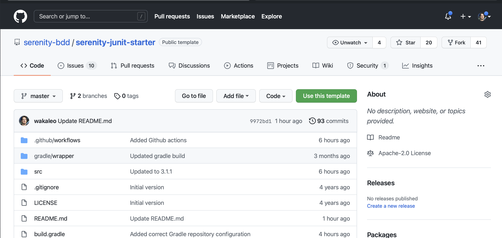

# Tu Primera Prueba Web

En este tutorial escribirás tu primera prueba con Serenity BDD, usando JUnit 5 y Selenium. Comenzaremos con algo simple y luego exploraremos algunas de las características que hacen a Serenity BDD especial. ¡Comencemos!

## Prerrequisitos

Para ejecutar este tutorial, necesitarás tener instalado en tu máquina:
* **Java**: Serenity BDD es una biblioteca de Java, así que necesitarás un JDK reciente instalado. JDK 17 o superior debería funcionar bien.
* **Un IDE de Java**: También necesitarás un Entorno de Desarrollo de Java como IntelliJ o Eclipse (y conocimiento práctico de Java).
* **Git**: Usaremos un proyecto inicial de GitHub, y el código de ejemplo para este proyecto también está en GitHub, así que asumiré que tienes un conocimiento básico de Git.

## Creando Tu Primer Proyecto Serenity BDD

Usaremos la plantilla de proyecto **[Serenity BDD con JUnit](https://github.com/serenity-bdd/serenity-junit-screenplay-starter)** para tener un proyecto simple funcionando rápidamente.

:::note
En este tutorial usaremos un estilo de automatización de pruebas bastante convencional, usando Action Classes y Page Objects. En el siguiente tutorial, veremos cómo hacer todo esto usando el Patrón Screenplay.
:::

Ve a la [página de la plantilla del proyecto en GitHub](https://github.com/serenity-bdd/serenity-junit-pageobjects-starter) y haz clic en [Use This Template](https://github.com/serenity-bdd/serenity-junit-pageobjects-starter/generate).



## Escribiendo una prueba simple

Comencemos con una prueba simple. Ejecutaremos una búsqueda simple del término "Cucumber" en el motor de búsqueda DuckDuckGo:


Primero, creamos un nuevo paquete para nuestras pruebas de DuckDuckGo. Los reportes de Serenity reflejan la estructura de directorios que usamos para organizar nuestras pruebas, así que es útil que la estructura y el nombre del paquete sean significativos.


### Estructura básica de la prueba

Ahora creamos una nueva clase de prueba (llamémosla "WhenSearchingByKeyword"), y un caso de prueba vacío (podemos llamarlo "theKeywordShouldAppearInTheResultsSidebar").

```java
package starter.duckduckgo;

import net.serenitybdd.junit5.SerenityJUnit5Extension;
import org.junit.jupiter.api.Test;
import org.junit.jupiter.api.extension.ExtendWith;

@ExtendWith(SerenityJUnit5Extension.class)
class WhenSearchingByKeyword {

    @Test
    void theKeywordShouldAppearInTheResultsSidebar() {

    }
}
```

:::caution
Hay algunas cosas a tener en cuenta aquí:
  - La anotación `@ExtendWith` le dice a JUnit que esta prueba usa Serenity - no olvides esta anotación o tu prueba no será reconocida como una prueba de Serenity
  - La anotación `@Test` usa la clase `org.junit.jupiter.api.Test`, de JUnit 5. Ten cuidado de no confundirla con la anotación de JUnit 4 del mismo nombre (`org.junit.Test`), de lo contrario tu prueba no se ejecutará.
:::

### Configurando WebDriver

A continuación, agreguemos el código que Serenity necesitará para funcionar. Primero, dado que esta será una prueba web, necesitamos agregar un campo WebDriver. Serenity gestiona el ciclo de vida de WebDriver por nosotros (incluso descarga los binarios de WebDriver), así que todo lo que necesitamos hacer es declarar un campo `WebDriver`, y anotarlo con la anotación `@Managed`. En el código de abajo, también he agregado el atributo `driver` y el atributo `options` para asegurar que el navegador se abra en modo headless:

```java
import net.serenitybdd.annotations.Managed;
import net.serenitybdd.junit5.SerenityJUnit5Extension;
import org.junit.jupiter.api.Test;
import org.junit.jupiter.api.extension.ExtendWith;
import org.openqa.selenium.WebDriver;

@ExtendWith(SerenityJUnit5Extension.class)
class WhenSearchingByKeyword {

    @Managed(driver = "chrome", options = "headless")
    WebDriver driver;

    @Test
    void theKeywordShouldAppearInTheResultsSidebar() {

    }
}
```

Este driver se usará a lo largo de la prueba, incluyendo cualquier Page Object o Action Class (más sobre estos más adelante) que se creen como parte de la prueba.

### Creando Action Classes

Podríamos simplemente comenzar a usar esta variable `driver` para interactuar con el navegador. Eso funcionaría bien. Pero mantener el código de prueba bien organizado y bien estructurado es esencial para mantener bajos los costos de mantenimiento. Y Serenity BDD nos da varias formas de hacer esto.

Una de las formas más simples de hacerlo se llama _Action Classes_. Las Action Classes son clases pequeñas y reutilizables con métodos que encapsulan acciones clave del usuario.

Por ejemplo, podríamos dividir esta prueba en tres pasos:
  - Navegar a la página principal de DuckDuckGo
  - Buscar por el término "Cucumber"
  - Verificar que el encabezado del tema principal en la página de resultados sea "Cucumber"

Comencemos con la primera acción: navegar a la página principal de DuckDuckGo. Crea una nueva clase llamada `NavigateActions` en el mismo paquete y agrega lo siguiente:

```java
import net.serenitybdd.core.steps.UIInteractions;

public class NavigateActions extends UIInteractions {
    public void toTheDuckDuckGoSearchPage() {
        openUrl("https://duckduckgo.com/");
    }
}
```

Una clase UI Interactions es una clase que contiene métodos que pueden interactuar con una página web. Cuando extendemos la clase `UIInteractions`, Serenity inyectará automáticamente la instancia de WebDriver `@Managed` que vimos antes cada vez que usemos una instancia de esta clase en nuestras pruebas.

La clase `UIInteractions` te da acceso a una variedad de métodos que puedes usar para interactuar con la página. Por ejemplo, como podemos ver en este ejemplo, el método `openUrl()` se usa para abrir una página en una URL específica.

A continuación, pasemos a la segunda acción, donde necesitamos buscar un término específico. Crea una nueva clase llamada `SearchActions`, y haz que extienda la clase `UIInteractions`.

```java
import net.serenitybdd.core.steps.UIInteractions;

public class SearchActions extends UIInteractions {}
```

Ahora agrega un método para buscar por un término dado, llamado `byKeyword`, que hará la búsqueda real. Dentro de este método, podemos usar la notación `$` para buscar elementos en la página usando localizadores CSS o XPath, así:

```java
import net.serenitybdd.core.steps.UIInteractions;
import org.openqa.selenium.Keys;

public class SearchActions extends UIInteractions {
    public void byKeyword(String keyword) {
      $("#searchbox_input").sendKeys(keyword, Keys.ENTER);
    }
}
```

### Creando una clase Page Component

El tercer paso de nuestra prueba es leer el título de la barra lateral de resultados de búsqueda y verificar que sea el valor que esperamos.


Podemos hacer esto con un objeto Page Component. Los Page Components (que extienden la clase `PageComponent`) son similares a las Action Classes, pero se enfocan en leer información de una parte particular de una página web, en lugar de modelar interacciones del usuario.

Para leer el título de la barra lateral en esta pantalla, crea una nueva clase llamada `SearchResultSidebar` con el siguiente código:

```java
import net.serenitybdd.core.pages.PageComponent;

public class SearchResultSidebar extends PageComponent {
    public String heading() {
        return $("[data-testid=about] h2").getText();
    }
}
```

Una vez más estamos localizando el elemento usando el operador `$` y un selector CSS, y retornando el valor de texto del elemento que encontramos.

### Usando Action Classes y Page Components en la Prueba

Ahora que hemos creado Action Classes para los primeros dos pasos, agreguémoslas a nuestra prueba. Serenity reconoce las Action Classes y los objetos Page Component y los instancia automáticamente con la instancia de WebDriver @Managed, así que simplemente necesitamos declararlos como campos de clase, y luego usarlos en nuestra prueba.

```java
import net.serenitybdd.junit5.SerenityJUnit5Extension;
import org.junit.jupiter.api.Test;
import net.thucydides.core.annotations.Managed;
import org.junit.jupiter.api.extension.ExtendWith;
import org.openqa.selenium.WebDriver;
import static org.assertj.core.api.Assertions.assertThat;

@ExtendWith(SerenityJUnit5Extension.class)
class WhenSearchingByKeyword {

    @Managed(driver = "chrome", options = "headless")
    WebDriver driver;

    NavigateActions navigate;
    SearchActions search;
    SearchResultSidebar searchResultSidebar;

    @Test
    void theKeywordShouldAppearInTheResultsSidebar() {
        navigate.toTheDuckDuckGoSearchPage();
        search.byKeyword("Cucumber");
        assertThat(searchResultSidebar.heading()).isEqualTo("Cucumber");
    }
}
```

### Reportando los pasos

Ahora tenemos una prueba funcional. Puedes ejecutarla desde tu IDE, o ejecutando `mvn verify` en la línea de comandos.

Sin embargo, hay un paso más que podemos hacer. Serenity BDD es una herramienta de documentación viva, lo que significa que busca documentar no solo qué pruebas se ejecutan, sino cómo se ejecutan.

Podemos controlar cómo Serenity reporta cada método en una clase `UIInteractions` usando la anotación `@Step`. Cuando colocas una anotación `@Step` en un método de `UIInteractions`, este método aparecerá en los reportes de Serenity cada vez que sea llamado.

Veamos cómo funciona. Actualiza las clases `NavigateActions` y `SearchActions` para incluir las anotaciones `@Step` así:

```java
import net.serenitybdd.annotations.Step;
import net.serenitybdd.core.steps.UIInteractions;

public class NavigateActions extends UIInteractions {
    @Step("Navegar a la página principal")
    public void toTheDuckDuckGoSearchPage() {
        openUrl("https://duckduckgo.com/");
    }
}
```

```java
import net.serenitybdd.annotations.Step;
import net.serenitybdd.core.steps.UIInteractions;
import org.openqa.selenium.Keys;

public class SearchActions extends UIInteractions {

    @Step("Buscar '{0}'")
    public void byKeyword(String keyword) {
      $("#searchbox_input").sendKeys(keyword, Keys.ENTER);
    }
}
```

### Reportando aserciones

El último paso de nuestra prueba es una aserción. Podemos reportar la aserción envolviéndola en el método `Serenity.reportThat()`, usando una expresión Lambda para la aserción real:

```java
@Test
void theKeywordShouldAppearInTheResultsSidebar() {
    navigate.toTheDuckDuckGoSearchPage();
    search.byKeyword("Cucumber");

    Serenity.reportThat("El término de búsqueda debería aparecer en el encabezado de la barra lateral",
            () -> assertThat(searchResultSidebar.heading()).isEqualTo("Cucumber")
    );
}
```


## Generando los reportes

Ejecutemos las pruebas y veamos cómo lucen los reportes. Elimina el paquete `wikipedia` (ya no necesitamos las pruebas de ejemplo), y ejecuta `mvn verify` desde la línea de comandos. Deberías ver una salida similar a la siguiente:

```bash
$ mvn verify
...
[INFO]  SERENITY TESTS: SUCCESS
[INFO] -----------------------------------------
[INFO] | Tests executed         | 1
[INFO] | Tests passed           | 1
[INFO] | Tests failed           | 0
[INFO] | Tests with errors      | 0
[INFO] | Tests compromised      | 0
[INFO] | Tests aborted          | 0
[INFO] | Tests pending          | 0
[INFO] | Tests ignored/skipped  | 0
[INFO] ------------------------ | --------------
[INFO] | Total Duration         | 5s 626ms
[INFO] | Fastest test took      | 5s 626ms
[INFO] | Slowest test took      | 5s 626ms
[INFO] -----------------------------------------
[INFO]
[INFO] SERENITY REPORTS
[INFO]   - Full Report: file:///Users/john/Projects/Serenity/serenity-new-documentation/serenity-users-guide/sample-code/docs-starter-tutorial/target/site/serenity/index.html
[INFO]
[INFO] --- maven-failsafe-plugin:3.0.0-M5:verify (default) @ serenity-junit-starter ---
[INFO] ------------------------------------------------------------------------
[INFO] BUILD SUCCESS
[INFO] ------------------------------------------------------------------------
[INFO] Total time:  21.729 s
[INFO] Finished at: 2021-11-30T11:27:29Z
[INFO] ------------------------------------------------------------------------
```

Ahora abre el archivo `index.html` en el directorio `target/site/serenity`. Deberías ver algo como esto:


Haz clic en la pestaña "Test Results" y abre el escenario "When Searching By Keyword". Esto debería mostrarte los detalles paso a paso de tu prueba:


## Conclusión

¡Felicitaciones! ¡Has escrito tu primera prueba con Serenity BDD, y has visto un poco de lo que Serenity BDD puede hacer!