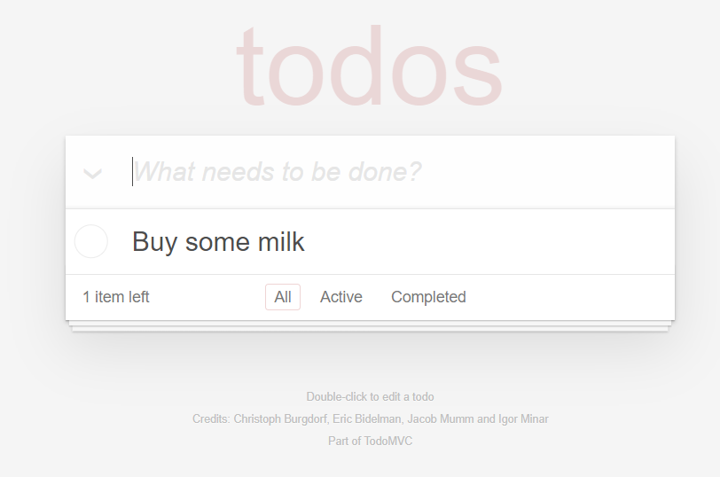

# Tu Primer Escenario con Screenplay

El Screenplay Pattern es una forma de escribir automatización de pruebas limpia, legible y escalable, modelada alrededor del usuario.

Screenplay se basa en buenos principios de ingeniería de software como el Principio de Responsabilidad Única, el Principio Abierto-Cerrado y el uso efectivo de Capas de Abstracción. Fomenta buenos hábitos de testing y suites de pruebas bien diseñadas que son fáciles de leer, fáciles de mantener y fáciles de extender, permitiendo a los equipos escribir pruebas automatizadas más robustas y confiables de manera más efectiva.

En esta sección, te mostraremos cómo escribir tu primer escenario con Screenplay usando Serenity BDD. Aprenderás cómo escribir un escenario simple para el conocido proyecto [TodoMVC](http://todomvc.com).


## Prerrequisitos

Para ejecutar este tutorial, necesitarás tener instalado en tu máquina:
* **Java**: Serenity BDD es una biblioteca de Java, así que necesitarás un JDK reciente instalado. JDK 17 o superior debería funcionar bien.
* **Un IDE de Java**: También necesitarás un Entorno de Desarrollo de Java como IntelliJ o Eclipse (y conocimiento práctico de Java).
* **Git**: Usaremos un proyecto inicial de GitHub, y el código de ejemplo para este proyecto también está en GitHub, así que asumiré que tienes un conocimiento básico de Git. También necesitarás un cliente de Git instalado en tu computadora.

## Introducción al Screenplay Pattern

El objetivo del Screenplay Pattern es ayudarte a escribir código de automatización de pruebas más limpio, más legible y más mantenible para cualquier dominio. Con Screenplay, tus pruebas usan un estilo intuitivo y legible como el siguiente:

```java
        wendy.attemptsTo(
                Navigate.toTheHomePage(),
                Search.byKeyword("Everest"),
                Ensure.that(DisplayedArticle.firstHeading()).isEqualTo("Mount Everest")
        );
```

Como puedes ver aquí, Screenplay usa un modelo centrado en el usuario, donde describimos _Actor_ que interactúan con una aplicación de varias formas para realizar _Task_ que les ayudan a alcanzar sus objetivos. Los Actor tienen _Ability_, como la capacidad de interactuar con un navegador web o consultar una base de datos, que les ayudan a realizar estos Task. Los Actor también pueden responder _Question_ sobre el estado del sistema, para que podamos verificar si una funcionalidad se está comportando como esperamos.


## Creando un proyecto Screenplay

### Usando las plantillas de proyecto de Serenity

La forma más rápida de iniciar un nuevo proyecto Screenplay es clonar uno de los proyectos iniciales. Para este tutorial, comenzaremos con el [proyecto inicial Serenity JUnit Screenplay](https://github.com/serenity-bdd/serenity-junit-screenplay-starter), que usa Serenity Screenplay y JUnit 5.

:::tip
Este proyecto inicial tiene una prueba Screenplay de ejemplo en la carpeta `src/test/java/starter/wikipedia`. No necesitarás este código para este tutorial, así que puedes eliminarlo sin problemas.
:::

### La estructura de directorios del proyecto

Usaremos algunas convenciones simples para organizar nuestras clases de prueba, basadas en la estructura estándar de proyectos Maven que puedes ver aquí:


Nuestro código de prueba se almacenará en dos carpetas, debajo de `src/test/java/todomvc`. El primer directorio llamado `features` contendrá nuestras clases de prueba. El segundo, `screenplay`, contendrá nuestras clases Screenplay. Las clases Screenplay están diseñadas para ser altamente modulares y reutilizables, y frecuentemente aparecen en muchas pruebas, así que tiene sentido mantenerlas separadas de las pruebas mismas.

Serenity organiza los resultados de las pruebas JUnit basándose en la estructura de paquetes que usamos, así que necesitamos indicarle el nombre del paquete raíz donde vivirán nuestras pruebas. Hacemos esto en el archivo `serenity.conf` en la carpeta `src/test/resources`. Abre este archivo y agrega la siguiente línea:

```
serenity.test.root = todomvc.features
```

## Escribiendo tu primer escenario

### Creando el caso de prueba

Para nuestro primer escenario, simplemente agregaremos un elemento 'por hacer' (digamos, "Comprar leche") a una lista vacía.

Comienza creando un nuevo caso de prueba vacío bajo el paquete `src/test/java/todomvc/features` así:

```java
package todomvc.features;

import net.serenitybdd.junit5.SerenityJUnit5Extension;
import org.junit.jupiter.api.DisplayName;
import org.junit.jupiter.api.Test;
import org.junit.jupiter.api.extension.ExtendWith;

@ExtendWith(SerenityJUnit5Extension.class)
class AddNewTodos {

    @Test
    @DisplayName("Add a todo item to an empty list")
    void addToEmptyList() {
    }
}
```

La línea `@ExtendWith(SerenityJUnit5Extension.class)` indica que esta es una prueba de Serenity BDD.

### Introduciendo al Actor

Screenplay usa un enfoque centrado en el Actor, donde nuestras pruebas describen _Actor_, que representan usuarios reales de nuestra aplicación, y las acciones que realizan.

En una prueba JUnit de Serenity BDD, podemos usar la anotación `@CastMember` para declarar un Actor así:

```java
    @CastMember(name = "Toby")
    Actor toby;
```

Esto instanciará un nuevo Actor (llamado Toby) para nuestra prueba, y le asignará una instancia de WebDriver que puede usar para interactuar con nuestra aplicación.

### Los Actor realizan Task e Interaction

En una prueba Screenplay, todo comienza con el Actor, quien interactúa con el sistema bajo prueba para alcanzar sus objetivos. En este caso, lo primero que Toby necesita hacer es abrir la aplicación TodoMvc en una URL dada. Hacemos esto llamando al método `attemptsTo()` en la clase `Actor`. El método `attemptsTo()` toma una lista de acciones que el Actor necesita realizar. Llamamos a estas acciones _Performable_. Generalmente hablamos de dos tipos de _Performable_:
  - _Interaction_, donde el Actor interactúa directamente con la aplicación (Hacer clic en un botón o Abrir una URL), y
  - _Task_, que son grupos de Interaction que el Actor necesita realizar para alcanzar algún objetivo (Agregar un artículo al carrito o comprar un artículo).

Un ejemplo de una Interaction simple es la interacción `Open.url()`, que abre una URL dada.

```java
Open.url("https://todomvc.com/examples/angularjs/#/")
```

En nuestra prueba "agregar un elemento por hacer a una lista vacía", el primer paso será que Toby abra el navegador en la página principal de la aplicación TodoMVC. Podemos hacer esto con el siguiente código:

```java
@Test
@DisplayName("Add a todo item to an empty list")
void addToEmptyList() {
    toby.attemptsTo(
        Open.url("https://todomvc.com/examples/angularjs/#/")
    );
}
```

### Los Actor pueden interactuar con una aplicación web

Lo siguiente que necesitamos hacer es ingresar un valor en el campo de entrada en la página principal de TodoMVC que puedes ver aquí:


Para ingresar un valor en un campo, podemos usar la clase de Interaction `Enter`. Este campo puede ser localizado usando un localizador CSS como _".new-todo"_. Así que para ingresar el valor en este campo, podemos usar la siguiente Interaction:

```java
Enter.theValue("Buy some milk").into(".new-todo")
```

No hay botón de enviar en este formulario. Para agregar el elemento a la lista, necesitamos presionar la tecla _RETURN_. Podemos hacer esto agregando el método `thenHit()`, así:

```java
Enter.theValue("Buy some milk").into(".new-todo").thenHit(Keys.RETURN)
```

Cuando agregamos esto a nuestra prueba, obtenemos lo siguiente:

```java
@Test
@DisplayName("Add a todo item to an empty list")
void addToEmptyList() {
    toby.attemptsTo(
        Open.url("https://todomvc.com/examples/angularjs/#/"),
        Enter.theValue("Buy some milk").into(".new-todo").thenHit(Keys.RETURN)
    );
}
```

### Los Actor pueden preguntar sobre el estado del sistema

Una vez que Toby presiona RETURN, el elemento será agregado a la lista de tareas, como podemos ver aquí:



Ahora necesitamos verificar que el elemento que ingresamos fue agregado exitosamente a esta lista. En Screenplay hacemos esto usando _Question_. Una Question es una clase que sabe cómo recuperar una pieza específica de información sobre el estado de la aplicación. Esto podría ser el valor de un campo de texto, el resultado de una llamada a una API REST, o incluso el resultado de una consulta a la base de datos.

En este caso, podemos identificar los nombres de los elementos en la lista usando un localizador CSS como ".todo-list li". Así que una _Question_ para recuperar cada uno de los elementos mostrados en la página podría verse así:

```java
Text.ofEach(".todo-list li")
```

Una Question no hace nada por sí misma - así como necesitamos un Actor para realizar una Interaction, también necesitamos un Actor para hacer una Question.

Una forma de hacer esto es usar el método `asksFor()`, así:

```java
        var todos = toby.asksFor(Text.ofEach(".todo-list label"));
```

Si agregamos una aserción de AssertJ para verificar que la lista contiene el valor que esperamos, nuestra prueba completa se verá así:

```java
import net.serenitybdd.junit5.SerenityJUnit5Extension;
import net.serenitybdd.screenplay.Actor;
import net.serenitybdd.screenplay.actions.Enter;
import net.serenitybdd.screenplay.actions.Open;
import net.serenitybdd.screenplay.annotations.CastMember;
import net.serenitybdd.screenplay.questions.Text;
import org.junit.jupiter.api.DisplayName;
import org.junit.jupiter.api.Test;
import org.junit.jupiter.api.extension.ExtendWith;
import org.openqa.selenium.Keys;

import static org.assertj.core.api.Assertions.assertThat;

@ExtendWith(SerenityJUnit5Extension.class)
class AddNewTodos {

    @CastMember(name = "Toby")
    Actor toby;

    @Test
    @DisplayName("Add a todo item to an empty list")
    void addToEmptyList() {
        toby.attemptsTo(
                Open.url("https://todomvc.com/examples/angularjs/#/"),
                Enter.theValue("Buy some milk").into(".new-todo").thenHit(Keys.RETURN)
        );
        var todos = toby.asksFor(Text.ofEach(".todo-list li"));
        assertThat(todos).containsExactly("Buy some milk");
    }
}

```

## Generando los reportes

Ejecutemos las pruebas y veamos cómo lucen los reportes. Simplemente ejecuta `mvn clean verify` desde la línea de comandos. Deberías ver una salida similar a la siguiente:

```bash
$ mvn verify
...
[INFO] -----------------------------------------
[INFO]  SERENITY TESTS: SUCCESS
[INFO] -----------------------------------------
[INFO] | Test cases executed    | 1
[INFO] | Tests executed         | 1
[INFO] | Tests passed           | 1
[INFO] | Tests failed           | 0
[INFO] | Tests with errors      | 0
[INFO] | Tests compromised      | 0
[INFO] | Tests aborted          | 0
[INFO] | Tests pending          | 0
[INFO] | Tests ignored/skipped  | 0
[INFO] ------------------------ | --------------
[INFO] | Total Duration         | 7s 292ms
[INFO] | Fastest test took      | 7s 292ms
[INFO] | Slowest test took      | 7s 292ms
[INFO] -----------------------------------------
[INFO]
[INFO] SERENITY REPORTS
[INFO]   - Full Report: file:///C:/Users/johns/projects/todomvc-screenplay-tutorial/target/site/serenity/index.html
[INFO]
[INFO] --- maven-failsafe-plugin:3.0.0-M5:verify (default) @ serenity-junit-screenplay-starter ---
[INFO] ------------------------------------------------------------------------
[INFO] BUILD SUCCESS
[INFO] ------------------------------------------------------------------------
[INFO] Total time:  21.660 s
[INFO] Finished at: 2022-04-04T13:34:26+01:00
[INFO] ------------------------------------------------------------------------
```

Ahora abre el archivo `index.html` en el directorio `target/site/serenity` usando un navegador web, y navega a la pestaña Test Results. Abre el escenario "Add a todo item to an empty list". Observa cómo el reporte muestra las acciones del Actor casi palabra por palabra:


## Conclusión

Ahora has visto solo un poco del poder del Screenplay Pattern. Para aprender más sobre lo que puedes hacer con el Screenplay Pattern, consulta [la documentación completa de Screenplay](../screenplay/screenplay_fundamentals).
