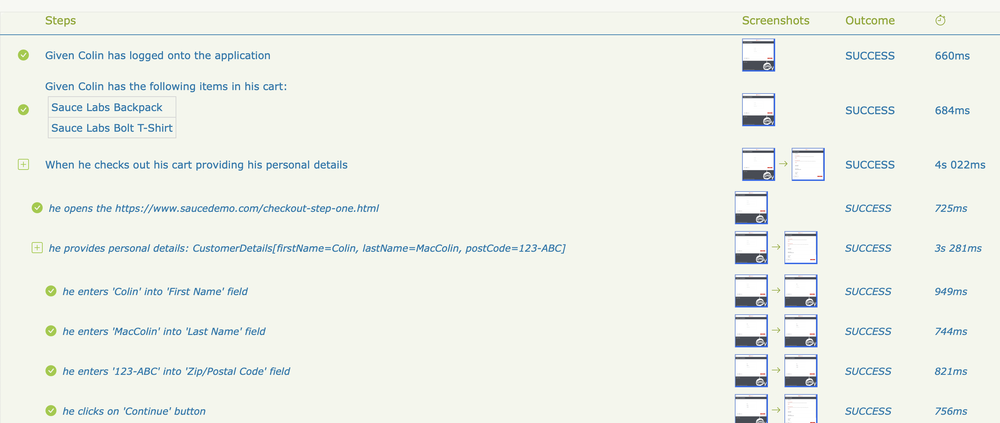

# Introdução

Serenity BDD é uma biblioteca de código aberto que visa tornar a ideia de documentação viva uma realidade.

O Serenity BDD ajuda você a escrever testes de aceitação e regressão automatizados mais limpos e fáceis de manter, de forma mais rápida. O Serenity também utiliza os resultados dos testes para produzir relatórios ilustrados e narrativos que documentam e descrevem o que sua aplicação faz e como ela funciona. O Serenity informa não apenas quais testes foram executados, mas, mais importante, quais requisitos foram testados.

Uma vantagem importante de usar o Serenity BDD é que você não precisa investir tempo construindo e mantendo seu próprio framework de automação. O Serenity BDD oferece forte suporte para diferentes tipos de testes de aceitação automatizados, incluindo:
- Testes web com Selenium.
- Testes de API REST com RestAssured.
- Testes automatizados altamente legíveis, fáceis de manter e escaláveis com o Screenplay Pattern.
- Especificações executáveis no estilo BDD com Cucumber

O Serenity não apenas relata quais requisitos foram testados, mas também relata _como_ eles foram testados. Ele inclui detalhes passo a passo de como um teste foi executado, incluindo capturas de tela opcionais, para que seus testes realmente documentem o que sua aplicação faz.

Mas o Serenity não é apenas sobre relatórios. O objetivo principal do Serenity é facilitar a escrita rápida de critérios de aceitação automatizados bem estruturados e fáceis de manter, usando sua biblioteca de testes BDD ou convencional favorita. Você pode trabalhar com ferramentas de Behavior-Driven-Development como o Cucumber, ou simplesmente usar o JUnit (4 ou 5). Você pode integrar com requisitos armazenados em uma fonte externa (como JIRA ou qualquer outra ferramenta de gerenciamento de casos de teste), ou simplesmente usar uma abordagem baseada em diretórios para organizar seus requisitos.

O Serenity também fornece uma série de recursos integrados que tornam a codificação de sua automação de testes mais rápida e confiável. Testadores que trabalham com o Serenity normalmente relatam automatizar testes com menos da metade do código que precisariam para um teste Selenium convencional.

:::info
Até novembro de 2014, o Serenity era conhecido pelo nome de Thucydides. Tucídides foi um historiador grego antigo que escreveu sobre a Guerra do Peloponeso no final do século V a.C. Ele foi o primeiro historiador a escrever sobre eventos dos quais realmente participou e, em muitos casos, ele registrou eventos que testemunhou diretamente.

De maneira semelhante, o Serenity BDD não apenas relata os resultados dos testes, mas também registra e documenta como cada cenário se desenvolve, proporcionando uma forma particularmente rica de relatórios de teste e documentação viva.
:::

