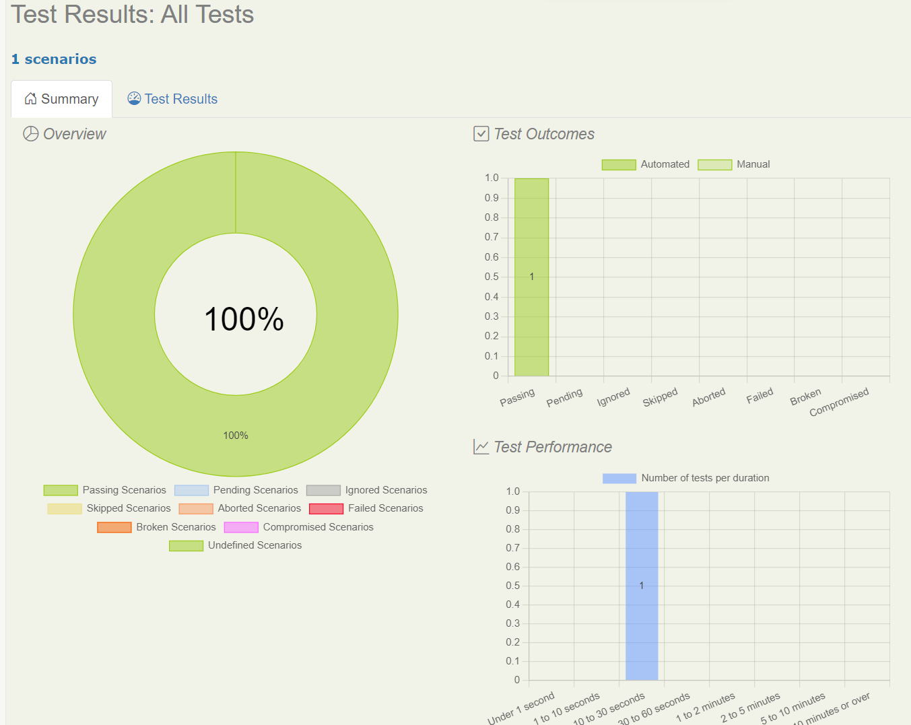

# Comecando com Cucumber usando Serenity BDD e Screenplay

:::tip Guia Completo de Cucumber Disponivel
Este tutorial foca em comecar com Cucumber e Screenplay. Para uma cobertura completa sobre configuracao do Cucumber, integracao com JUnit 5, execucao paralela e topicos avancados, consulte a secao [Cucumber com JUnit 5](/docs/cucumber/cucumber-junit5).
:::

## Objetivos
Ao final deste tutorial, voce tera completado as seguintes atividades.
1. Escrever sua primeira **especificacao por exemplo** usando a linguagem [Gherkin](https://cucumber.io/docs/gherkin/reference/) em um arquivo `.feature` para o conhecido projeto [TodoMVC](http://todomvc.com)
2. Tornar a especificacao (o arquivo `.feature` do Passo 1 acima) executavel usando Serenity BDD e Cucumber com o Screenplay Pattern
3. Criar uma **documentacao viva** que tambem serve como relatorio de teste e relatorio de progresso

## Pre-requisitos
Para executar este tutorial, voce precisara de algumas coisas instaladas em sua maquina:
* **Java**: O Serenity BDD e uma biblioteca Java, entao voce precisara de um JDK recente instalado. JDK 17 ou superior deve funcionar bem.
* **Maven**: Voce precisara do Maven 3 ou superior instalado em seu computador. Ele atua como uma ferramenta de build que tambem baixa as dependencias durante a compilacao.
* **Uma IDE Java**: Voce tambem precisara de um Ambiente de Desenvolvimento Java como IntelliJ ou Eclipse (e conhecimento pratico de Java).
* **Git**: Usaremos um projeto inicial no Github, e o codigo de exemplo deste projeto tambem esta no Github, entao assumo que voce tem um entendimento basico de Git.

## Criando seu projeto

A maneira mais rapida de iniciar um novo projeto Serenity BDD com [Cucumber](https://cucumber.io/) e clonar o projeto inicial. Para este tutorial, usaremos o projeto template **[Serenity BDD com Cucumber e Screenplay](https://github.com/serenity-bdd/serenity-cucumber-starter)**, que usa Serenity BDD e Cucumber 6.x.

Este projeto vem com um arquivo feature de exemplo ja implementado para nossa referencia. Por enquanto, vamos ignora-lo e comecar a escrever um novo arquivo feature do zero.

:::info

Apenas para garantir que os arquivos de exemplo do template inicial nao interfiram em nossa experiencia neste tutorial, **exclua** os seguintes arquivos/diretorios.

1. Diretorio - `src/test/resources/features/search`
2. Diretorio - `src/test/java/starter/navigation`
3. Diretorio - `src/test/java/starter/search`
4. Arquivo - `src/test/java/starter/stepdefinitions/SearchStepDefinitions.java`

:::

## A estrutura de diretorios do projeto
Usaremos algumas convencoes simples para organizar nossos arquivos feature e as classes Java de suporte, baseadas na estrutura padrao de projeto Maven descrita abaixo:

```
src
├───main
│   └───java
│       └───starter
└───test
    ├───java
    │   └───starter
    │       └───helpers
    │       └───stepdefinitions
    └───resources
        └───features
```

Aqui estao alguns pontos a observar sobre a estrutura de diretorios.
1. Como testaremos a aplicacao web [TodoMVC](http://todomvc.com) disponivel publicamente, nao teremos nenhum codigo no diretorio `src/main`.
2. Usaremos o diretorio `src/test/resources/features` para armazenar nossos arquivos `.feature`, que sao especificacoes que definem os requisitos.
3. Usaremos o diretorio `src/test/java/starter/stepdefinitions` para armazenar o codigo que implementa os passos mencionados em nossos arquivos `.feature`. Este codigo e chamado de Glue code ou Step Definition.
4. Usaremos o diretorio `src/test/java/starter/helpers` para armazenar o codigo de quaisquer classes auxiliares necessarias para nossas Step Definition.

## Escrevendo o primeiro arquivo feature
Agora, vamos comecar escrevendo um arquivo feature para descrever a adicao de um novo item a lista de tarefas.

Crie um novo arquivo com o nome `add_new_todo.feature` no diretorio `src/test/resources/features` com o seguinte conteudo.

```gherkin
Feature: Add new item to TODO list

Scenario: Add buying milk to the list
Given Rama is looking at his TODO list
When he adds "Buy some milk" to the list
Then he sees "Buy some milk" as an item in the TODO list
```

## Escrevendo o esqueleto das Step Definition
Para traduzir os passos em `add_new_todo.feature` em acoes executaveis, escrevemos classes Java chamadas **Step Definition**.

Vamos criar um novo arquivo chamado `AddItemStepDefinitions.java` no diretorio `src/test/java/starter/stepdefinitions` com o seguinte conteudo de esqueleto. Note que este e apenas um conteudo de esqueleto. Adicionaremos a implementacao a esta classe depois.

```java
package starter.stepdefinitions;

import io.cucumber.java.PendingException;
import io.cucumber.java.en.Given;
import io.cucumber.java.en.Then;
import io.cucumber.java.en.When;
import net.serenitybdd.screenplay.Actor;

public class AddItemStepDefinitions {

    @Given("{actor} is looking at his TODO list")
    public void actor_is_looking_at_his_todo_list(Actor actor) {
        // Escreva o codigo aqui que transforma a frase acima em acoes concretas
        throw new PendingException("Implement me");
    }
    @When("{actor} adds {string} to the list")
    public void he_adds_to_the_list(Actor actor, String itemName) {
        // Escreva o codigo aqui que transforma a frase acima em acoes concretas
        throw new PendingException("Implement me");
    }
    @Then("{actor} sees {string} as an item in the TODO list")
    public void he_sees_as_an_item_in_the_todo_list(Actor actor, String expectedItemName) {
        // Escreva o codigo aqui que transforma a frase acima em acoes concretas
        throw new PendingException("Implement me");
    }

}
```

O arquivo acima apenas lanca excecoes sempre que o Cucumber tenta executar os passos e os marca como Pendentes.

Vamos tentar executar o build Maven para ver o resultado neste estagio. Esperamos que o build falhe indicando que os cenarios estao pendentes de implementacao.

Execute o seguinte comando em um terminal ou prompt de comando.

```bash
mvn clean verify
```

Quando o comando for concluido, voce vera uma saida similar a seguinte.

```
[ERROR] Tests run: 1, Failures: 0, Errors: 1, Skipped: 0, Time elapsed: 7.255 s <<< FAILURE! - in starter.CucumberTestSuite
[ERROR] Add new item to TODO list.Add buying milk to the list  Time elapsed: 0.713 s  <<< ERROR!
io.cucumber.java.PendingException: TODO: implement me

[INFO]
[INFO] Results:
[INFO]
[ERROR] Errors:
[ERROR]   TODO: implement me
[INFO]
[ERROR] Tests run: 1, Failures: 0, Errors: 1, Skipped: 0

...
...
...

[INFO] -----------------------------------------
[INFO]  SERENITY TESTS: PENDING
[INFO] -----------------------------------------
[INFO] | Test cases executed    | 1
[INFO] | Tests executed         | 1
[INFO] | Tests passed           | 0
[INFO] | Tests failed           | 0
[INFO] | Tests with errors      | 0
[INFO] | Tests compromised      | 0
[INFO] | Tests aborted          | 0
[INFO] | Tests pending          | 1
[INFO] | Tests ignored/skipped  | 0
[INFO] ------------------------ | --------------
[INFO] | Total Duration         | 365ms
[INFO] | Fastest test took      | 365ms
[INFO] | Slowest test took      | 365ms
[INFO] -----------------------------------------

...
...
...

[INFO]
[INFO] --- maven-failsafe-plugin:3.0.0-M5:verify (default) @ cucumber-starter ---
[INFO] ------------------------------------------------------------------------
[INFO] BUILD FAILURE
[INFO] ------------------------------------------------------------------------
[INFO] Total time:  30.465 s
[INFO] Finished at: 2022-08-12T14:52:57+05:30
[INFO] ------------------------------------------------------------------------

```

A saida acima e como esperavamos. O build esta falhando com uma `PendingException` e os testes estao marcados como pendentes.

## Criando Classes Auxiliares para Step Definition
Ate agora, temos apenas Step Definition vazias. Vamos implementar testes reais agora. Para implementar os testes reais, vamos criar algumas classes auxiliares.

#### Page Object
Vamos primeiro criar um arquivo `TodoListPage.java` no diretorio `src/test/java/starter/helpers` com o seguinte conteudo.

```java
package starter.helpers;

import net.serenitybdd.core.pages.PageObject;
import net.serenitybdd.screenplay.targets.Target;
import net.serenitybdd.annotations.DefaultUrl;


@DefaultUrl("https://todomvc.com/examples/angularjs/#/")
public class TodoListPage extends PageObject {
    public static Target ITEM_NAME_FIELD = Target.the("item name field").locatedBy(".new-todo");

    public static Target ITEMS_LIST = Target.the(" item list").locatedBy(".todo-list li");
}
```

Esta classe e o que chamamos de `PageObject`. Ela contem todas as informacoes que precisaremos para usar uma pagina web especifica, o app TODO, neste caso.

A anotacao `@DefaultUrl` especifica a URL que precisa ser digitada na barra de endereco do navegador para acessar esta pagina.

Ha dois campos estaticos `ITEM_NAME_FIELD` e `ITEMS_LIST` que ajudam a identificar elementos HTML especificos na pagina, que usaremos depois em nossos arquivos de Step Definition.

#### Auxiliar de Navegacao

Vamos criar um arquivo `NavigateTo.java` no diretorio `src/test/java/starter/helpers` com o seguinte conteudo.

```java
package starter.helpers;

import net.serenitybdd.screenplay.Performable;
import net.serenitybdd.screenplay.Task;
import net.serenitybdd.screenplay.actions.Open;

public class NavigateTo {
     public static Performable theTodoListPage() {
        return Task.where("{0} opens the Todo list page",
                Open.browserOn().the(TodoListPage.class));
    }
}
```
A classe acima usa o [Screenplay Pattern](/docs/screenplay/screenplay_fundamentals) do Serenity BDD para descrever o comportamento de forma clara. Esta classe nos ajuda a abrir o navegador com a URL correta.

#### Definicao de Acao

Em seguida, vamos criar um arquivo `AddAnItem.java` no diretorio `src/test/java/starter/helpers` com o seguinte conteudo.

```java
package starter.helpers;

import net.serenitybdd.screenplay.Performable;
import net.serenitybdd.screenplay.Task;
import net.serenitybdd.screenplay.actions.Enter;
import org.openqa.selenium.Keys;

public class AddAnItem {

    public static Performable withName(String itemName){
        return Task.where("{0} adds an item with name "+itemName,
                Enter.theValue(itemName)
                        .into(TodoListPage.ITEM_NAME_FIELD)
                        .thenHit(Keys.ENTER)
        );
    }
}
```

O codigo acima explica os passos necessarios para adicionar um item a lista, ou seja, digitar o nome do item na caixa de texto e pressionar a tecla ENTER.

## Adicionando Detalhes as Step Definition

Agora que nossas classes auxiliares estao prontas, podemos adicionar detalhes reais as Step Definition presentes em `AddItemStepDefinitions.java`

Abra o arquivo `AddItemStepDefinitions.java` (ja criamos este arquivo) e edite-o para ter o seguinte conteudo.

```java
package starter.stepdefinitions;

import io.cucumber.java.en.Given;
import io.cucumber.java.en.Then;
import io.cucumber.java.en.When;
import net.serenitybdd.screenplay.Actor;
import net.serenitybdd.screenplay.ensure.Ensure;
import starter.helpers.AddAnItem;
import starter.helpers.NavigateTo;
import starter.helpers.TodoListPage;

public class AddItemStepDefinitions {
    @Given("{actor} is looking at his TODO list")
    public void actor_is_looking_at_his_todo_list(Actor actor) {
        actor.wasAbleTo(NavigateTo.theTodoListPage());
    }
    @When("{actor} adds {string} to the list")
    public void he_adds_to_the_list(Actor actor, String itemName) {
       actor.attemptsTo(AddAnItem.withName(itemName));
    }
    @Then("{actor} sees {string} as an item in the TODO list")
    public void he_sees_as_an_item_in_the_todo_list(Actor actor, String expectedItemName) {
        actor.attemptsTo(Ensure.that(TodoListPage.ITEMS_LIST).hasText(expectedItemName));
    }

}
```

Observe como o codigo se le como ingles falado. Este e um dos efeitos colaterais agradaveis de usar o Screenplay Pattern em suas Step Definition do Cucumber.

## Executando o build novamente

Agora, vamos executar o build novamente emitindo o seguinte comando do terminal ou linha de comando.

```bash
mvn clean verify
```

Agora, voce vera a seguinte saida.

```
[INFO] Tests run: 1, Failures: 0, Errors: 0, Skipped: 0, Time elapsed: 28.42 s - in starter.CucumberTestSuite
[INFO]
[INFO] Results:
[INFO]
[INFO] Tests run: 1, Failures: 0, Errors: 0, Skipped: 0

...
...
...

[INFO] -----------------------------------------
[INFO]  SERENITY TESTS: SUCCESS
[INFO] -----------------------------------------
[INFO] | Test cases executed    | 1
[INFO] | Tests executed         | 1
[INFO] | Tests passed           | 1
[INFO] | Tests failed           | 0
[INFO] | Tests with errors      | 0
[INFO] | Tests compromised      | 0
[INFO] | Tests aborted          | 0
[INFO] | Tests pending          | 0
[INFO] | Tests ignored/skipped  | 0
[INFO] ------------------------ | --------------
[INFO] | Total Duration         | 20s 001ms
[INFO] | Fastest test took      | 20s 001ms
[INFO] | Slowest test took      | 20s 001ms
[INFO] -----------------------------------------
[INFO]
[INFO] SERENITY REPORTS
[INFO]   - Full Report: file:///C:/Users/calib/source-codes/temp/serenity-cucumber-starter/target/site/serenity/index.html
[INFO]
[INFO] --- maven-failsafe-plugin:3.0.0-M5:verify (default) @ cucumber-starter ---
[INFO] ------------------------------------------------------------------------
[INFO] BUILD SUCCESS
[INFO] ------------------------------------------------------------------------
[INFO] Total time:  49.894 s
[INFO] Finished at: 2022-08-12T15:28:52+05:30
[INFO] ------------------------------------------------------------------------

```

Sim, os testes passaram e o build foi bem-sucedido agora. Conseguimos testar nossa funcionalidade com sucesso!

## Relatorios e Documentacao Viva

Se voce observar com cuidado, a saida do comando `mvn clean verify` nos informou que um relatorio foi criado em `target/site/serenity/index.html`

Quando voce abrir este arquivo em um navegador web, vera um relatorio bonito como este.



Voce tambem pode encontrar os resultados por Feature detalhando os Scenario na aba `Features`.


Sinta-se a vontade para navegar pelos links neste relatorio e explorar.

Isso tambem e chamado de **Documentacao Viva** do produto porque e gerada pela execucao real das especificacoes, ao inves de apenas escreve-la como uma wiki ou um documento armazenado na nuvem. Conforme o produto evolui, os Scenario serao adicionados e este relatorio e a unica fonte de verdade sobre o que funciona e o que esta pendente de ser implementado no produto.

Em alguns casos, as equipes usam este documento para integrar novos membros a equipe. Se voce estiver se sentindo aventureiro, este documento tambem pode ser usado como um guia do usuario.

## Proximos Passos
Neste tutorial, apenas tocamos a superficie do uso do Serenity BDD com Cucumber. Ha multiplas maneiras de personalizar o relatorio, organizar os arquivos feature, implementar as Step Definition e assim por diante. Consulte os links no manual do usuario para saber mais sobre outras possibilidades.

