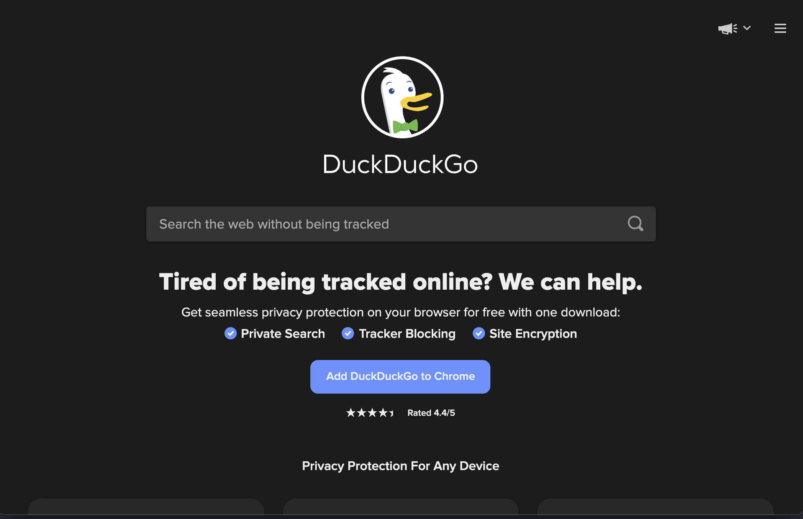

# Seu Primeiro Teste Web
Neste tutorial, você vai escrever seu primeiro teste com Serenity BDD, usando JUnit 5 e Selenium. Vamos começar de forma simples e depois explorar algumas das funcionalidades que tornam o Serenity BDD especial. Então, vamos começar!

## Pré-requisitos
Para executar este tutorial, você precisará de algumas coisas instaladas em sua máquina:
* **Java**: O Serenity BDD é uma biblioteca Java, então você precisará de um JDK recente instalado. JDK 17 ou superior deve funcionar bem.
* **Uma IDE Java**: Você também precisará de um Ambiente de Desenvolvimento Java como IntelliJ ou Eclipse (e conhecimento prático de Java).
* **Git**: Usaremos um projeto inicial no Github, e o código de exemplo deste projeto também está no Github, então assumo que você tem um entendimento básico de Git.

## Criando Seu Primeiro Projeto Serenity BDD

Usaremos o projeto template **[Serenity BDD com JUnit](https://github.com/serenity-bdd/serenity-junit-screenplay-starter)** para ter um projeto simples funcionando rapidamente.

:::note
Usaremos um estilo de automação de testes bastante convencional neste tutorial, usando Action Class e Page Object. No próximo tutorial, veremos como fazer tudo isso usando o Screenplay Pattern.
:::

Acesse a [página do template do projeto no Github](https://github.com/serenity-bdd/serenity-junit-pageobjects-starter) e clique em [Use This Template](https://github.com/serenity-bdd/serenity-junit-pageobjects-starter/generate).


## Escrevendo um teste simples

Vamos começar com um teste simples. Vamos executar uma busca simples pela palavra-chave "Cucumber" no mecanismo de busca DuckDuckGo:


Primeiro, criamos um novo pacote para nossos testes do DuckDuckGo. Os relatórios de teste do Serenity espelham a estrutura de diretórios que usamos para organizar nossos testes, então ajuda tornar a estrutura e o nome do pacote significativos.


### Estrutura básica do teste

Agora criamos uma nova classe de teste (vamos chamá-la de "WhenSearchingByKeyword") e um caso de teste vazio (podemos chamá-lo de "theKeywordShouldAppearInTheResultsSidebar").

```java
package starter.duckduckgo;

import net.serenitybdd.junit5.SerenityJUnit5Extension;
import org.junit.jupiter.api.Test;
import org.junit.jupiter.api.extension.ExtendWith;

@ExtendWith(SerenityJUnit5Extension.class)
class WhenSearchingByKeyword {

    @Test
    void theKeywordShouldAppearInTheResultsSidebar() {

    }
}
```

:::caution
Há algumas coisas a observar aqui:
  - A anotação `@ExtendWith` informa ao JUnit que este teste usa o Serenity - não esqueça esta anotação ou seu teste não será reconhecido como um teste Serenity
  - A anotação `@Test` usa a classe `org.junit.jupiter.api.Test`, do JUnit 5. Tenha cuidado para não confundir com a anotação do JUnit 4 de mesmo nome (`org.junit.Test`), caso contrário seu teste não será executado.
:::

### Configurando o WebDriver

Em seguida, vamos adicionar o código que o Serenity precisará para funcionar. Primeiro, como este será um teste web, precisamos adicionar um campo WebDriver. O Serenity gerencia o ciclo de vida do WebDriver para nós (ele até baixa os binários do WebDriver para nós), então tudo que precisamos fazer é declarar um campo `WebDriver` e anotá-lo com a anotação `@Managed`. No código abaixo, também adicionei o atributo `driver` e o atributo `options` para garantir que o navegador abra em modo headless:

```java
import net.serenitybdd.annotations.Managed;
import net.serenitybdd.junit5.SerenityJUnit5Extension;
import org.junit.jupiter.api.Test;
import org.junit.jupiter.api.extension.ExtendWith;
import org.openqa.selenium.WebDriver;

@ExtendWith(SerenityJUnit5Extension.class)
class WhenSearchingByKeyword {

    @Managed(driver = "chrome", options = "headless")
    WebDriver driver;

    @Test
    void theKeywordShouldAppearInTheResultsSidebar() {

    }
}
```

Este driver será usado em todo o teste, incluindo em qualquer Page Object ou Action Class (mais sobre isso adiante) que forem criados como parte do teste.

### Criando Action Classes

Poderíamos simplesmente começar a usar esta variável `driver` para interagir com o navegador. Isso funcionaria bem. Mas manter o código de teste bem organizado e estruturado é essencial para manter os custos de manutenção baixos. E o Serenity BDD nos dá várias maneiras de fazer isso.

Uma das maneiras mais simples de fazer isso é chamada de _Action Class_. As Action Class são classes pequenas e reutilizáveis com métodos que encapsulam ações-chave do usuário.

Por exemplo, poderíamos dividir este teste em três passos:
  - Navegar para a página inicial do DuckDuckGo
  - Buscar pela palavra-chave "Cucumber"
  - Verificar que o cabeçalho do tópico principal na página de resultados é "Cucumber"

Vamos começar com a primeira ação: navegar para a página inicial do DuckDuckGo. Crie uma nova classe chamada `NavigateActions` no mesmo pacote e adicione o seguinte:

```java
import net.serenitybdd.core.steps.UIInteractions;

public class NavigateActions extends UIInteractions {
    public void toTheDuckDuckGoSearchPage() {
        openUrl("https://duckduckgo.com/");
    }
}
```

Uma classe UI Interactions é uma classe contendo métodos que podem interagir com uma página web. Quando estendemos a classe `UIInteractions`, o Serenity automaticamente injetará a instância do WebDriver `@Managed` que vimos anteriormente sempre que usarmos uma instância desta classe em nossos testes.

A classe `UIInteractions` dá acesso a uma série de métodos que você pode usar para interagir com a página. Por exemplo, como podemos ver neste exemplo, o método `openUrl()` é usado para abrir uma página em uma URL especificada.

Em seguida, vamos passar para a segunda ação, onde precisamos buscar por um termo específico. Crie uma nova classe chamada `SearchActions` e faça-a estender a classe `UIInteractions`.

```java
import net.serenitybdd.core.steps.UIInteractions;

public class SearchActions extends UIInteractions {}
```

Agora adicione um método para buscar por uma palavra-chave dada, chamado `byKeyword`, que fará a busca real. Dentro deste método, podemos usar a notação `$` para buscar elementos na página usando localizadores CSS ou XPath, assim:

```java
import net.serenitybdd.core.steps.UIInteractions;
import org.openqa.selenium.Keys;

public class SearchActions extends UIInteractions {
    public void byKeyword(String keyword) {
      $("#searchbox_input").sendKeys(keyword, Keys.ENTER);
    }
}
```

### Criando uma classe Page Component

O terceiro passo do nosso teste é ler o título da barra lateral dos resultados de busca e verificar se é o valor esperado.


Podemos fazer isso com um objeto Page Component. Os Page Component (que estendem a classe `PageComponent`) são similares às Action Class, mas focam em ler informações de uma parte específica de uma página web, ao invés de modelar interações do usuário.

Para ler o título da barra lateral nesta tela, crie uma nova classe chamada `SearchResultSidebar` com o seguinte código:

```java
import net.serenitybdd.core.pages.PageComponent;

public class SearchResultSidebar extends PageComponent {
    public String heading() {
        return $("[data-testid=about] h2").getText();
    }
}
```

Mais uma vez estamos localizando o elemento usando o operador `$` e um seletor CSS, e retornando o valor de texto do elemento encontrado.

### Usando Action Classes e Page Components no Teste

Agora que criamos Action Class para os dois primeiros passos, vamos adicioná-las ao nosso teste. O Serenity reconhece Action Class e objetos Page Component e os instancia automaticamente com a instância do WebDriver @Managed, então simplesmente precisamos declará-los como campos da classe, e então usá-los em nosso teste.

```java
import net.serenitybdd.junit5.SerenityJUnit5Extension;
import org.junit.jupiter.api.Test;
import net.thucydides.core.annotations.Managed;
import org.junit.jupiter.api.extension.ExtendWith;
import org.openqa.selenium.WebDriver;
import static org.assertj.core.api.Assertions.assertThat;

@ExtendWith(SerenityJUnit5Extension.class)
class WhenSearchingByKeyword {

    @Managed(driver = "chrome", options = "headless")
    WebDriver driver;

    NavigateActions navigate;
    SearchActions search;
    SearchResultSidebar searchResultSidebar;

    @Test
    void theKeywordShouldAppearInTheResultsSidebar() {
        navigate.toTheDuckDuckGoSearchPage();
        search.byKeyword("Cucumber");
        assertThat(searchResultSidebar.heading()).isEqualTo("Cucumber");
    }
}
```

### Reportando os passos

Agora temos um teste funcionando. Você pode executá-lo de dentro da sua IDE, ou executando `mvn verify` na linha de comando.

No entanto, há mais um passo que podemos fazer. O Serenity BDD é uma ferramenta de documentação viva, o que significa que ele visa documentar não apenas quais testes são executados, mas como eles são executados.

Podemos controlar como o Serenity reporta cada método em uma classe `UIInteractions` usando a anotação `@Step`. Quando você coloca uma anotação `@Step` em um método `UIInteractions`, este método aparecerá nos relatórios do Serenity sempre que for chamado.

Vamos ver como funciona. Atualize as classes `NavigateActions` e `SearchActions` para incluir as anotações `@Step` assim:

```java
import net.serenitybdd.annotations.Step;
import net.serenitybdd.core.steps.UIInteractions;

public class NavigateActions extends UIInteractions {
    @Step("Navigate to the home page")
    public void toTheDuckDuckGoSearchPage() {
        openUrl("https://duckduckgo.com/");
    }
}
```

```java
import net.serenitybdd.annotations.Step;
import net.serenitybdd.core.steps.UIInteractions;
import org.openqa.selenium.Keys;

public class SearchActions extends UIInteractions {

    @Step("Search for '{0}'")
    public void byKeyword(String keyword) {
      $("#searchbox_input").sendKeys(keyword, Keys.ENTER);
    }
}
```

### Reportando asserções

O último passo do nosso teste é uma asserção. Podemos reportar a asserção envolvendo-a no método `Serenity.reportThat()`, usando uma expressão Lambda para a asserção real:

```java
@Test
void theKeywordShouldAppearInTheResultsSidebar() {
    navigate.toTheDuckDuckGoSearchPage();
    search.byKeyword("Cucumber");

    Serenity.reportThat("The keyword should appear in the sidebar heading",
            () -> assertThat(searchResultSidebar.heading()).isEqualTo("Cucumber")
    );
}
```


## Gerando os relatórios

Vamos executar os testes e ver como ficam os relatórios. Delete o pacote `wikipedia` (não precisamos mais dos testes de exemplo) e execute `mvn verify` na linha de comando. Você deverá ver uma saída parecida com esta:

```bash
$ mvn verify
...
[INFO]  SERENITY TESTS: SUCCESS
[INFO] -----------------------------------------
[INFO] | Tests executed         | 1
[INFO] | Tests passed           | 1
[INFO] | Tests failed           | 0
[INFO] | Tests with errors      | 0
[INFO] | Tests compromised      | 0
[INFO] | Tests aborted          | 0
[INFO] | Tests pending          | 0
[INFO] | Tests ignored/skipped  | 0
[INFO] ------------------------ | --------------
[INFO] | Total Duration         | 5s 626ms
[INFO] | Fastest test took      | 5s 626ms
[INFO] | Slowest test took      | 5s 626ms
[INFO] -----------------------------------------
[INFO]
[INFO] SERENITY REPORTS
[INFO]   - Full Report: file:///Users/john/Projects/Serenity/serenity-new-documentation/serenity-users-guide/sample-code/docs-starter-tutorial/target/site/serenity/index.html
[INFO]
[INFO] --- maven-failsafe-plugin:3.0.0-M5:verify (default) @ serenity-junit-starter ---
[INFO] ------------------------------------------------------------------------
[INFO] BUILD SUCCESS
[INFO] ------------------------------------------------------------------------
[INFO] Total time:  21.729 s
[INFO] Finished at: 2021-11-30T11:27:29Z
[INFO] ------------------------------------------------------------------------
```

Agora abra o arquivo `index.html` no diretório `target/site/serenity`. Você deverá ver algo assim:


Clique na aba "Test Results" e abra o cenário "When Searching By Keyword". Isso deverá mostrar os detalhes passo a passo do seu teste:


## Conclusao

Parabens! Voce escreveu seu primeiro teste Serenity BDD e viu um pouco do que o Serenity BDD pode fazer!
