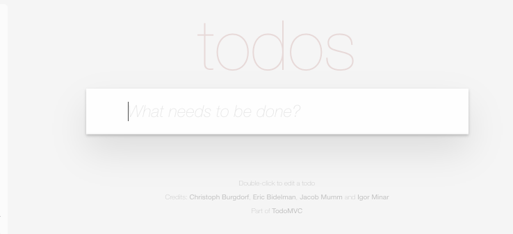
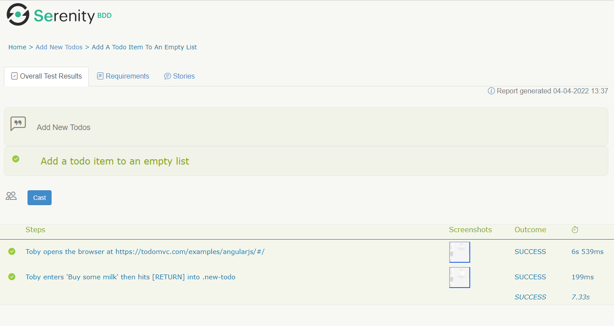

# Seu Primeiro Cenario com Screenplay

O Screenplay Pattern e uma forma de escrever automacao de testes limpa, legivel e escalavel, modelada em torno do usuario.

O Screenplay se baseia em bons principios de engenharia de software, como o Principio da Responsabilidade Unica, o Principio Aberto-Fechado e o uso efetivo de Camadas de Abstracao. Ele incentiva bons habitos de teste e suites de teste bem projetadas que sao faceis de ler, faceis de manter e faceis de estender, permitindo que equipes escrevam testes automatizados mais robustos e confiaveis de forma mais eficaz.

Nesta secao, mostraremos como escrever seu primeiro cenario Screenplay usando Serenity BDD. Voce aprendera como escrever um cenario simples para o conhecido projeto [TodoMVC](http://todomvc.com).


## Pre-requisitos
Para executar este tutorial, voce precisara de algumas coisas instaladas em sua maquina:
* **Java**: O Serenity BDD e uma biblioteca Java, entao voce precisara de um JDK recente instalado. JDK 17 ou superior deve funcionar bem.
* **Uma IDE Java**: Voce tambem precisara de um Ambiente de Desenvolvimento Java como IntelliJ ou Eclipse (e conhecimento pratico de Java).
* **Git**: Usaremos um projeto inicial no Github, e o codigo de exemplo deste projeto tambem esta no Github, entao assumo que voce tem um entendimento basico de Git. Voce tambem precisara de um cliente Git instalado em seu computador.

## Introducao ao Screenplay Pattern

O objetivo do Screenplay Pattern e ajuda-lo a escrever codigo de automacao de testes mais limpo, legivel e sustentavel para qualquer dominio. Com Screenplay, seus testes usam um estilo intuitivo e legivel como o seguinte:
```java
        wendy.attemptsTo(
                Navigate.toTheHomePage(),
                Search.byKeyword("Everest"),
                Ensure.that(DisplayedArticle.firstHeading()).isEqualTo("Mount Everest")
        );
```

Como voce pode ver aqui, o Screenplay usa um modelo centrado no usuario, onde descrevemos _Actor_ (atores) que interagem com uma aplicacao de varias maneiras para realizar _Task_ (tarefas) que os ajudam a alcancar seus objetivos. Os Actor tem _Ability_ (habilidades), como a habilidade de interagir com um navegador web ou consultar um banco de dados, que os ajudam a realizar essas Task. Os Actor tambem podem responder _Question_ (perguntas) sobre o estado do sistema, para que possamos verificar se uma funcionalidade esta se comportando da maneira esperada.


## Criando um projeto Screenplay

### Usando os projetos template do Serenity
A maneira mais rapida de iniciar um novo projeto Screenplay e clonar um dos projetos iniciais. Para este tutorial, comecaremos com o [projeto inicial Serenity JUnit Screenplay](https://github.com/serenity-bdd/serenity-junit-screenplay-starter), que usa Serenity Screenplay e JUnit 5.

:::tip
Este projeto inicial tem um teste Screenplay de exemplo na pasta `src/test/java/starter/wikipedia`. Voce nao precisara deste codigo para este tutorial, entao pode exclu-lo com seguranca.
:::

### A estrutura de diretorios do projeto
Usaremos algumas convencoes simples para organizar nossas classes de teste, baseadas na estrutura padrao de projeto Maven que voce pode ver aqui:


Nosso codigo de teste sera armazenado em duas pastas, sob `src/test/java/todomvc`. O primeiro diretorio chamado `features` contera nossas classes de teste. O segundo, `screenplay`, contera nossas classes Screenplay. As classes Screenplay sao projetadas para serem altamente modulares e reutilizaveis, e frequentemente aparecem em muitos testes, entao faz sentido mante-las separadas dos proprios testes.

O Serenity organiza os resultados de testes JUnit com base na estrutura de pacotes que usamos, entao precisamos informar o nome do pacote raiz onde nossos testes estarao. Fazemos isso no arquivo `serenity.conf` na pasta `src/test/resources`. Abra este arquivo e adicione a seguinte linha:

```
serenity.test.root = todomvc.features
```

## Escrevendo seu primeiro cenario

### Criando o caso de teste
Para nosso primeiro cenario, simplesmente adicionaremos um item 'to do' (digamos, "Buy some milk") a uma lista vazia.

Comece criando um novo caso de teste vazio no pacote `src/test/java/todomvc/features` assim:

```java
package todomvc.features;

import net.serenitybdd.junit5.SerenityJUnit5Extension;
import org.junit.jupiter.api.DisplayName;
import org.junit.jupiter.api.Test;
import org.junit.jupiter.api.extension.ExtendWith;

@ExtendWith(SerenityJUnit5Extension.class)
class AddNewTodos {

    @Test
    @DisplayName("Add a todo item to an empty list")
    void addToEmptyList() {
    }
}
```

A linha `@ExtendWith(SerenityJUnit5Extension.class)` indica que este e um teste Serenity BDD.

### Apresentando o Actor

O Screenplay usa uma abordagem centrada no ator, onde nossos testes descrevem _Actor_, que representam usuarios reais de nossa aplicacao, e as acoes que eles realizam.

Em um teste JUnit com Serenity BDD, podemos usar a anotacao `@CastMember` para declarar um Actor assim:

```java
    @CastMember(name = "Toby")
    Actor toby;
```

Isso instanciara um novo Actor (chamado Toby) para nosso teste e atribuira uma instancia de WebDriver que ele pode usar para interagir com nossa aplicacao.

### Actor realizam Task e Interaction
Em um teste Screenplay, tudo comeca com o Actor, que interage com o sistema em teste para alcancar seus objetivos. Neste caso, a primeira coisa que Toby precisa fazer e abrir a aplicacao TodoMvc em uma determinada URL. Fazemos isso chamando o metodo `attemptsTo()` na classe `Actor`. O metodo `attemptsTo()` recebe uma lista de acoes que o Actor precisa realizar. Chamamos essas acoes de _Performable_. Geralmente falamos de dois tipos de _Performable_:
  - _Interaction_, onde o Actor interage diretamente com a aplicacao (clicar em um botao ou abrir uma URL), e
  - _Task_, que sao grupos de Interaction que o Actor precisa realizar para alcancar algum objetivo (adicionar um item ao carrinho ou comprar um item).

Um exemplo de uma Interaction simples e a Interaction `Open.url()`, que abre uma determinada URL.

```java
Open.url("https://todomvc.com/examples/angularjs/#/")
```

Em nosso teste "add a todo item to an empty list", o primeiro passo sera Toby abrir o navegador na pagina inicial da aplicacao TodoMVC. Podemos fazer isso com o seguinte codigo:

```java
@Test
@DisplayName("Add a todo item to an empty list")
void addToEmptyList() {
    toby.attemptsTo(
        Open.url("https://todomvc.com/examples/angularjs/#/")
    );
}
```

### Actor podem interagir com uma aplicacao web

A proxima coisa que precisamos fazer e inserir um valor no campo de entrada na pagina inicial do TodoMVC que voce pode ver aqui:



Para inserir um valor em um campo, podemos usar a classe de Interaction `Enter`. Este campo pode ser localizado usando um localizador CSS como _".new-todo"_. Entao, para inserir o valor neste campo, podemos usar a seguinte Interaction:

```java
Enter.theValue("Buy some milk").into(".new-todo")
```

Nao ha botao de envio neste formulario. Para adicionar o item a lista, precisamos pressionar a tecla _RETURN_. Podemos fazer isso adicionando o metodo `thenHit()`, assim:

```java
Enter.theValue("Buy some milk").into(".new-todo").thenHit(Keys.RETURN)
```

Quando adicionamos isso ao nosso teste, obtemos o seguinte:

```java
@Test
@DisplayName("Add a todo item to an empty list")
void addToEmptyList() {
    toby.attemptsTo(
        Open.url("https://todomvc.com/examples/angularjs/#/"),
        Enter.theValue("Buy some milk").into(".new-todo").thenHit(Keys.RETURN)
    );
}
```

### Actor podem perguntar sobre o estado do sistema

Uma vez que Toby pressiona RETURN, o item sera adicionado a lista de tarefas, como podemos ver aqui:


Agora precisamos verificar se o item que inserimos foi adicionado com sucesso a esta lista. No Screenplay fazemos isso usando _Question_. Uma Question e uma classe que sabe como recuperar uma informacao especifica sobre o estado da aplicacao. Isso pode ser o valor de um campo de texto, o resultado de uma chamada de API REST, ou ate mesmo o resultado de uma consulta ao banco de dados.

Neste caso, podemos identificar os nomes dos itens de tarefas na lista usando um localizador CSS como ".todo-list li". Entao uma _Question_ para recuperar cada um dos itens de tarefas exibidos na pagina pode ser assim:
```java
Text.ofEach(".todo-list li")
```

Uma Question nao faz nada sozinha - assim como precisamos de um Actor para realizar uma Interaction, tambem precisamos de um Actor para fazer uma Question.

Uma maneira de fazer isso e usar o metodo `asksFor()`, assim:

```java
        var todos = toby.asksFor(Text.ofEach(".todo-list label"));
```

Se adicionarmos uma asserção AssertJ para verificar que a lista contem o valor esperado, nosso teste completo ficara assim:

```java
import net.serenitybdd.junit5.SerenityJUnit5Extension;
import net.serenitybdd.screenplay.Actor;
import net.serenitybdd.screenplay.actions.Enter;
import net.serenitybdd.screenplay.actions.Open;
import net.serenitybdd.screenplay.annotations.CastMember;
import net.serenitybdd.screenplay.questions.Text;
import org.junit.jupiter.api.DisplayName;
import org.junit.jupiter.api.Test;
import org.junit.jupiter.api.extension.ExtendWith;
import org.openqa.selenium.Keys;

import static org.assertj.core.api.Assertions.assertThat;

@ExtendWith(SerenityJUnit5Extension.class)
class AddNewTodos {

    @CastMember(name = "Toby")
    Actor toby;

    @Test
    @DisplayName("Add a todo item to an empty list")
    void addToEmptyList() {
        toby.attemptsTo(
                Open.url("https://todomvc.com/examples/angularjs/#/"),
                Enter.theValue("Buy some milk").into(".new-todo").thenHit(Keys.RETURN)
        );
        var todos = toby.asksFor(Text.ofEach(".todo-list li"));
        assertThat(todos).containsExactly("Buy some milk");
    }
}

```

## Gerando os relatorios

Vamos executar os testes e ver como ficam os relatorios. Basta executar `mvn clean verify` na linha de comando. Voce devera ver uma saida parecida com esta:

```bash
$ mvn verify
...
[INFO] -----------------------------------------
[INFO]  SERENITY TESTS: SUCCESS
[INFO] -----------------------------------------
[INFO] | Test cases executed    | 1
[INFO] | Tests executed         | 1
[INFO] | Tests passed           | 1
[INFO] | Tests failed           | 0
[INFO] | Tests with errors      | 0
[INFO] | Tests compromised      | 0
[INFO] | Tests aborted          | 0
[INFO] | Tests pending          | 0
[INFO] | Tests ignored/skipped  | 0
[INFO] ------------------------ | --------------
[INFO] | Total Duration         | 7s 292ms
[INFO] | Fastest test took      | 7s 292ms
[INFO] | Slowest test took      | 7s 292ms
[INFO] -----------------------------------------
[INFO]
[INFO] SERENITY REPORTS
[INFO]   - Full Report: file:///C:/Users/johns/projects/todomvc-screenplay-tutorial/target/site/serenity/index.html
[INFO]
[INFO] --- maven-failsafe-plugin:3.0.0-M5:verify (default) @ serenity-junit-screenplay-starter ---
[INFO] ------------------------------------------------------------------------
[INFO] BUILD SUCCESS
[INFO] ------------------------------------------------------------------------
[INFO] Total time:  21.660 s
[INFO] Finished at: 2022-04-04T13:34:26+01:00
[INFO] ------------------------------------------------------------------------
```

Agora abra o arquivo `index.html` no diretorio `target/site/serenity` usando um navegador web e navegue ate a aba Test Results. Abra o cenario "Add a todo item to an empty list". Observe como o relatorio renderiza as acoes do Actor quase palavra por palavra:




## Conclusao

Voce agora viu apenas um pouco do poder do Screenplay Pattern. Para saber mais sobre o que voce pode fazer com o Screenplay Pattern, confira [a documentacao completa do Screenplay](../screenplay/screenplay_fundamentals).
